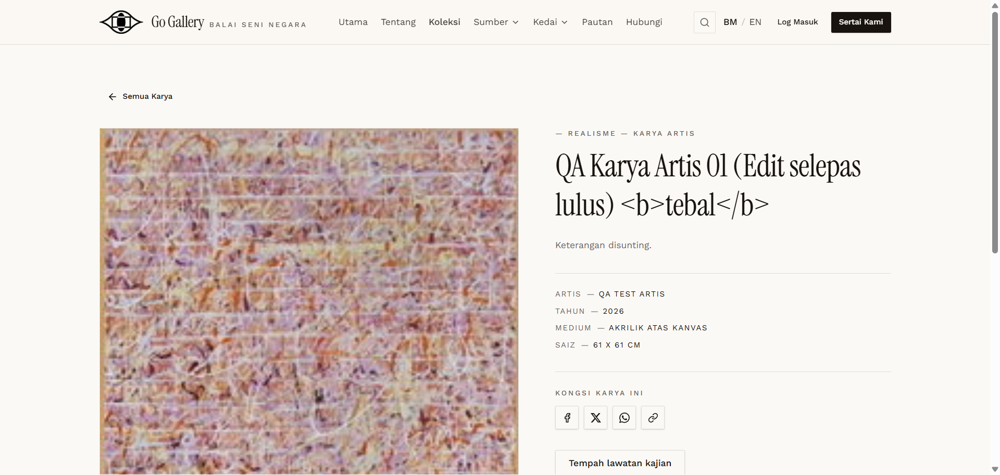

# KOL-11 — HTML / script injection

- **Module:** Koleksi (Admin, Artist, Galeri)
- **Target:** https://martp.nizamjensani.digital/ · dashboard `/dashboard/collection` · public `/collection`, `/resources/artists-art`, `/resources/nag-collection`
- **Date:** 2026-09-25 · **Tool:** playwright-cli (headed)
- **Priority:** P0
- **Status:** **PASS**

## Preconditions
Artist editing an approved karya.

## Steps
1. Title `… <b>tebal</b>`.
2. Keterangan (Kod HTML) with `<script>`, ``, `javascript:` link.
3. Save; open the public detail.

## Expected result
Escaped or stripped; nothing executes.

## Actual result
Title shown as literal text; public page has no `<script>`, `onerror` or `javascript:` link; `window.__x*` undefined; no JS dialog.

## Evidence

