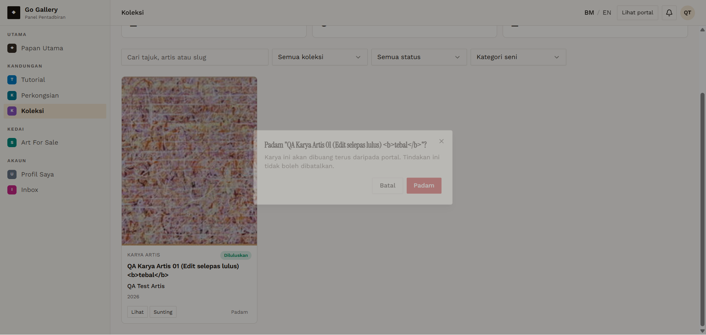

# KOL-12 — Delete with confirmation (Artist, Galeri, Admin)

- **Module:** Koleksi (Admin, Artist, Galeri)
- **Target:** https://martp.nizamjensani.digital/ · dashboard `/dashboard/collection` · public `/collection`, `/resources/artists-art`, `/resources/nag-collection`
- **Date:** 2026-09-25 · **Tool:** playwright-cli (headed)
- **Priority:** P0
- **Status:** **PASS**

## Preconditions
Own items.

## Steps
1. Artist: Padam → Batal, then Padam → Padam.
2. Galeri: Padam → confirm.
3. Admin: delete both admin items.
4. Check counts and detail URLs.

## Expected result
Batal keeps; confirm removes; detail 404.

## Actual result
Dialog: 'Padam "…"? Karya ini akan dibuang terus… tidak boleh dibatalkan.' Batal keeps the item. After confirming, Artist and Galeri counters return to 0; detail URLs return 404. Admin totals return to the original 2,566 / 99 / 2,467.

## Evidence

