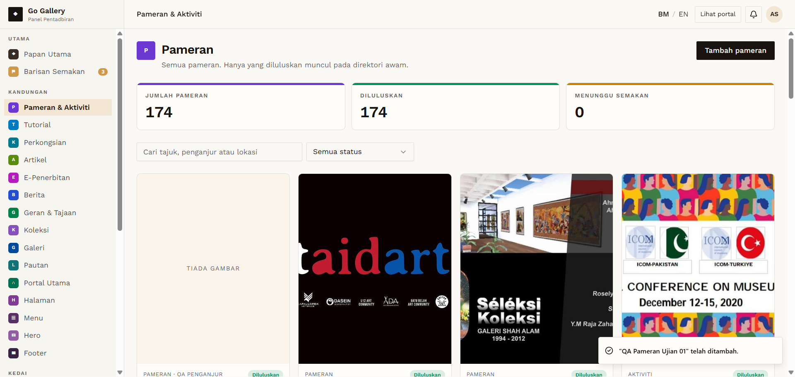

# PAM-02 — Create Pameran → auto-approved, listed

- **Module:** Pameran & Aktiviti (Admin)
- **Target:** https://martp.nizamjensani.digital/ · admin `/dashboard/exhibitions` · public `/resources/exhibitions`
- **Date:** 2026-09-25 · **Tool:** playwright-cli (headed) · **Role:** Admin (login-page quick-login, "Ahmad Safwan")
- **Priority:** P0
- **Status:** **PASS**

## Preconditions
Admin logged in.

## Steps
1. Tambah pameran; Jenis acara = Pameran.
2. Fill Tajuk `QA Pameran Ujian 01`, Penganjur, dates 2026-10-01 to 2026-10-31, Huraian, Lokasi, Pautan luar.
3. Simpan pameran.

## Expected result
Saved; the form says admin-added items are approved directly.

## Actual result
Saved as **Diluluskan** immediately; card shows 'AKAN DATANG' (upcoming) computed from dates. Counters 173→174.

## Evidence

