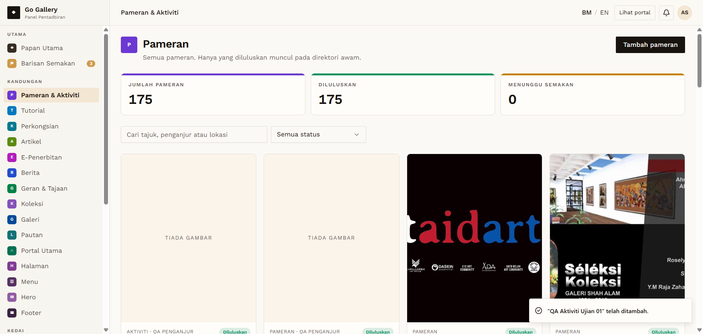
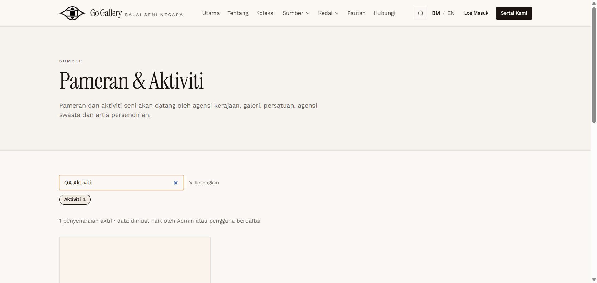

# PAM-04 — Create Aktiviti

- **Module:** Pameran & Aktiviti (Admin)
- **Target:** https://martp.nizamjensani.digital/ · admin `/dashboard/exhibitions` · public `/resources/exhibitions`
- **Date:** 2026-09-25 · **Tool:** playwright-cli (headed) · **Role:** Admin (login-page quick-login, "Ahmad Safwan")
- **Priority:** P0
- **Status:** **PASS (minor wording)**

## Preconditions
Admin logged in.

## Steps
1. Tambah pameran; set Jenis acara = Aktiviti (options: Pameran, Aktiviti).
2. Fill `QA Aktiviti Ujian 01`, Penganjur, 10–12 Nov 2026, Lokasi `Dewan QA`.
3. Simpan.

## Expected result
Saved as an Aktiviti, approved, listed under the Aktiviti tab.

## Actual result
Card 'AKTIVITI … Diluluskan'. Public `?kind=activity` shows it under the Aktiviti tab (count 1). Minor: the modal title stays 'Tambah pameran' even when Jenis acara is Aktiviti.

## Evidence
 
