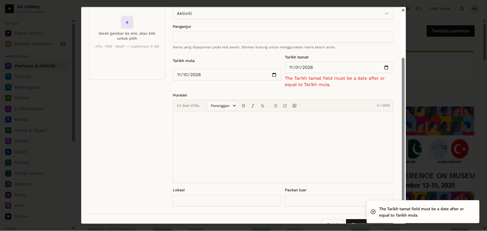

# PAM-05 — End date before start date

- **Module:** Pameran & Aktiviti (Admin)
- **Target:** https://martp.nizamjensani.digital/ · admin `/dashboard/exhibitions` · public `/resources/exhibitions`
- **Date:** 2026-09-25 · **Tool:** playwright-cli (headed) · **Role:** Admin (login-page quick-login, "Ahmad Safwan")
- **Priority:** P1
- **Status:** **PASS (cosmetic)**

## Preconditions
Create form open.

## Steps
1. Set Tarikh mula 2026-11-10 and Tarikh tamat 2026-11-01.
2. Save.

## Expected result
Rejected with a clear error.

## Actual result
Not saved; modal stays open with 'The Tarikh tamat field must be a date after or equal to Tarikh mula' — English text mixed with the Malay field name (cosmetic).

## Evidence

