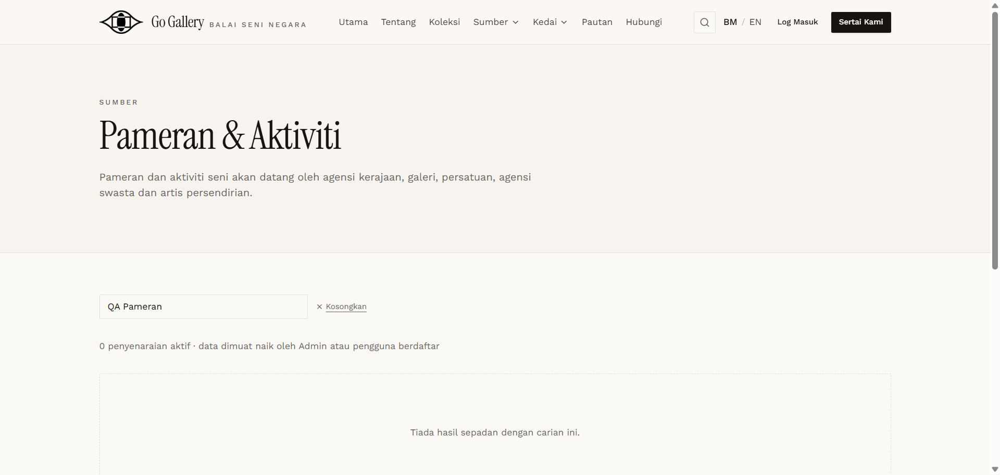

# PAM-07 — Reject → hidden from public

- **Module:** Pameran & Aktiviti (Admin)
- **Target:** https://martp.nizamjensani.digital/ · admin `/dashboard/exhibitions` · public `/resources/exhibitions`
- **Date:** 2026-09-25 · **Tool:** playwright-cli (headed) · **Role:** Admin (login-page quick-login, "Ahmad Safwan")
- **Priority:** P0
- **Status:** **PASS (observation: no reason)**

## Preconditions
Approved item.

## Steps
1. Click Tolak.
2. Search public page.

## Expected result
Status Ditolak; hidden.

## Actual result
Toast '… kini Ditolak.' (no reason or confirmation). Public search: 0 results.

## Evidence

