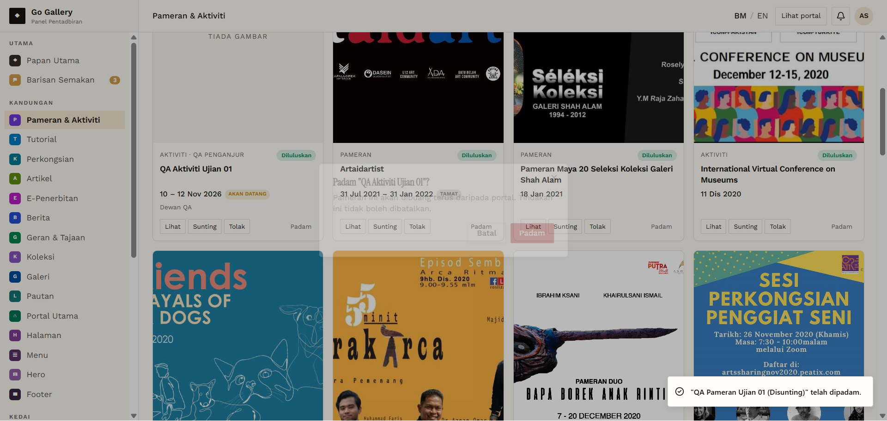

# PAM-09 — Delete with confirmation

- **Module:** Pameran & Aktiviti (Admin)
- **Target:** https://martp.nizamjensani.digital/ · admin `/dashboard/exhibitions` · public `/resources/exhibitions`
- **Date:** 2026-09-25 · **Tool:** playwright-cli (headed) · **Role:** Admin (login-page quick-login, "Ahmad Safwan")
- **Priority:** P0
- **Status:** **PASS**

## Preconditions
Two QA items (Pameran, Aktiviti).

## Steps
1. Padam on each → dialog → Padam.
2. Check dashboard, public search and the old detail URL.

## Expected result
Removed everywhere; detail URL returns 404.

## Actual result
Dialog: 'Padam "…"? Pameran ini akan dibuang terus… Tindakan ini tidak boleh dibatalkan.' After confirming both, the dashboard count returned to 173, public search shows 0 results, and the detail URL returns '404 Tidak Dijumpai'.

## Evidence

