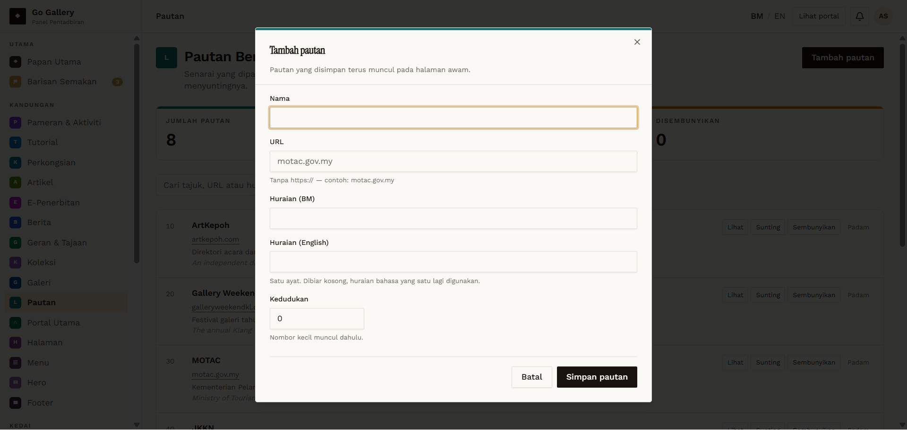
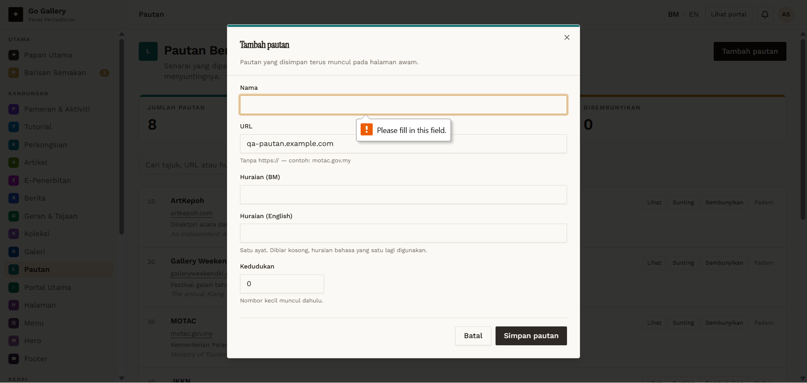

# PTN-01 — Create — Nama and URL required

- **Module:** Pautan (Admin only)
- **Target:** https://martp.nizamjensani.digital/ · dashboard `/dashboard/links` · public `/links`
- **Date:** 2026-09-25 · **Tool:** playwright-cli (headed) · **Role:** Admin (login-page quick-login, "Ahmad Safwan")
- **Priority:** P1
- **Status:** **PASS (cosmetic)**

## Preconditions
Admin logged in, `/dashboard/links` (8 links before testing).

## Steps
1. Tambah pautan.
2. Simpan pautan with everything empty.
3. Fill only Nama; then only URL.

## Expected result
Blocked in each case.

## Actual result
Modal stays open. Native tooltip 'Please fill in this field.' on the missing field each time (English on Malay UI).

## Evidence
 
