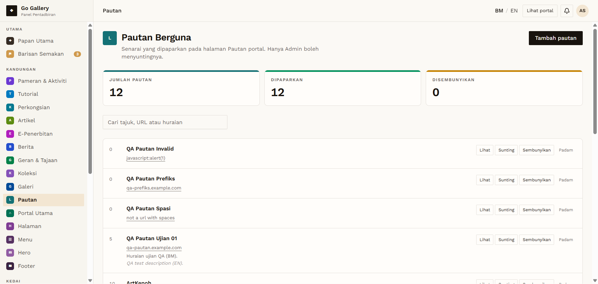

# PTN-02 — Create a valid pautan (published immediately)

- **Module:** Pautan (Admin only)
- **Target:** https://martp.nizamjensani.digital/ · dashboard `/dashboard/links` · public `/links`
- **Date:** 2026-09-25 · **Tool:** playwright-cli (headed) · **Role:** Admin (login-page quick-login, "Ahmad Safwan")
- **Priority:** P0
- **Status:** **PASS**

## Preconditions
Admin logged in.

## Steps
1. Tambah pautan: Nama `QA Pautan Ujian 01`, URL `qa-pautan.example.com` (no https://), Huraian BM and English, Kedudukan 5.
2. Simpan pautan.

## Expected result
Saved; the form says saved links appear publicly at once.

## Actual result
Toast '… telah ditambah.'; counters go up (DIPAPARKAN +1). No approval step (admin-only module).

## Evidence

