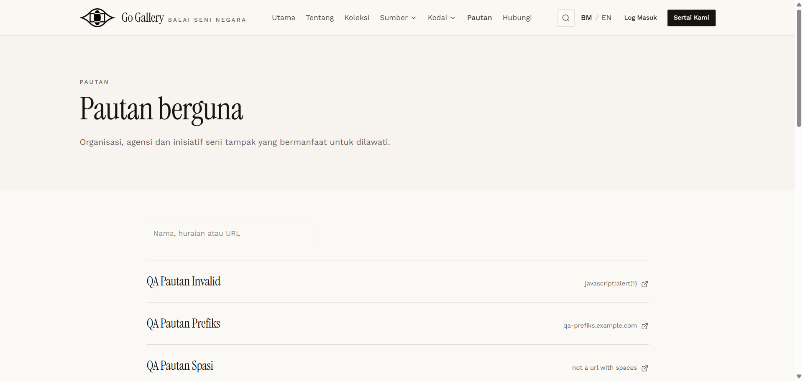

# PTN-03 — Public /links: order, language, search, link attributes

- **Module:** Pautan (Admin only)
- **Target:** https://martp.nizamjensani.digital/ · dashboard `/dashboard/links` · public `/links`
- **Date:** 2026-09-25 · **Tool:** playwright-cli (headed) · **Role:** Admin (login-page quick-login, "Ahmad Safwan")
- **Priority:** P0
- **Status:** **PASS**

## Preconditions
PTN-02 done.

## Steps
1. Open `/links`; read the order.
2. Open `/en/links`.
3. Search 'Ujian 01' and a non-matching text.

## Expected result
Sorted by Kedudukan; description follows the language; search works.

## Actual result
Sorted by Kedudukan ascending (position 0 items, then 5, then the existing 10, 20, …). BM page shows the BM description, `/en/links` shows the English one. Link opens in a new tab (`target=_blank`, `rel=noreferrer`) to `https://qa-pautan.example.com/`. Search finds 1 result; a non-match shows 'Tiada pautan disenaraikan buat masa ini'.

## Evidence

