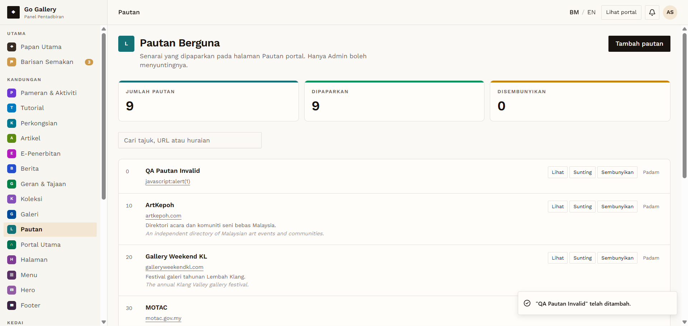
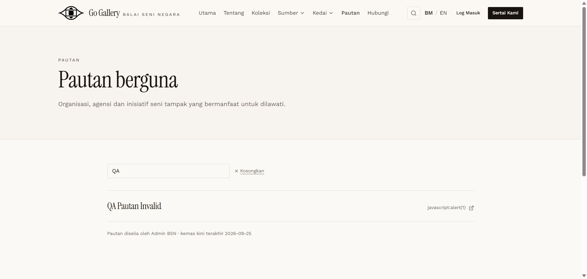

# PTN-05 — Invalid URLs

- **Module:** Pautan (Admin only)
- **Target:** https://martp.nizamjensani.digital/ · dashboard `/dashboard/links` · public `/links`
- **Date:** 2026-09-25 · **Tool:** playwright-cli (headed) · **Role:** Admin (login-page quick-login, "Ahmad Safwan")
- **Priority:** P0
- **Status:** **FAIL**

## Preconditions
Create form open.

## Steps
1. URL `javascript:alert(1)`; save.
2. URL `not a url with spaces`; save.
3. Check the dashboard and the public page.

## Expected result
Both rejected with a clear message.

## Actual result
**Both were saved** and published. The system prepends `https://`, giving public links `https://javascript:alert(1)` and `https://not a url with spaces`, shown on `/links` and opening a new tab to a broken address. Not executable script (the scheme prefix neutralises `javascript:`), but no URL validation exists on this form; the Berita form does validate its link. **Defect: invalid URLs accepted and published.**

## Evidence
 

## Retest 2026-10-01
**PASS (fixed)**. See [RT-PTN-05](../retest-2026-10-01/RT-PTN-05.md).
