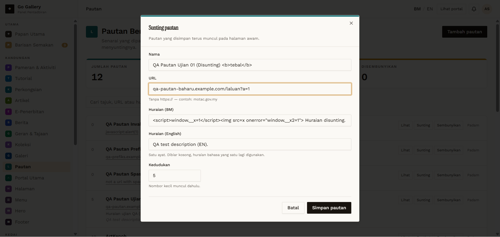

# PTN-07 — Edit pautan

- **Module:** Pautan (Admin only)
- **Target:** https://martp.nizamjensani.digital/ · dashboard `/dashboard/links` · public `/links`
- **Date:** 2026-09-25 · **Tool:** playwright-cli (headed) · **Role:** Admin (login-page quick-login, "Ahmad Safwan")
- **Priority:** P0
- **Status:** **PASS**

## Preconditions
`QA Pautan Ujian 01` exists.

## Steps
1. Sunting; read pre-filled values.
2. Change name, description and URL (`qa-pautan-baharu.example.com/laluan?a=1`); save.

## Expected result
Pre-filled; saved; public page updated.

## Actual result
Pre-filled: name, URL without https://, both descriptions, position 5. Saved; toast 'telah dikemas kini'; the public link now points to `https://qa-pautan-baharu.example.com/laluan?a=1`.

## Evidence

