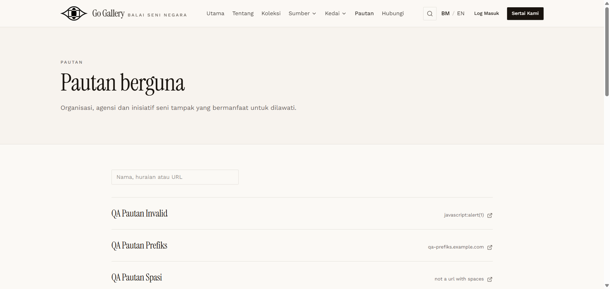

# PTN-08 — HTML / script in name and description

- **Module:** Pautan (Admin only)
- **Target:** https://martp.nizamjensani.digital/ · dashboard `/dashboard/links` · public `/links`
- **Date:** 2026-09-25 · **Tool:** playwright-cli (headed) · **Role:** Admin (login-page quick-login, "Ahmad Safwan")
- **Priority:** P0
- **Status:** **PASS**

## Preconditions
Edit form open.

## Steps
1. Name `… <b>tebal</b>`.
2. Description BM ` …`.
3. Save; open `/links`.

## Expected result
Escaped; nothing executes.

## Actual result
Both shown as literal text on the public page; no `<b>`, `<script>` or `onerror` elements; `window.__x*` undefined.

## Evidence

