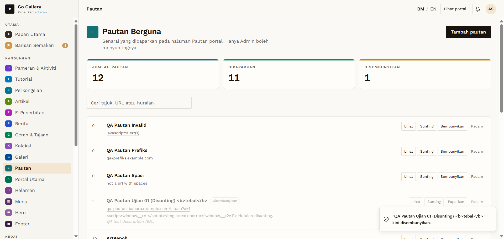

# PTN-09 — Sembunyikan / Paparkan

- **Module:** Pautan (Admin only)
- **Target:** https://martp.nizamjensani.digital/ · dashboard `/dashboard/links` · public `/links`
- **Date:** 2026-09-25 · **Tool:** playwright-cli (headed) · **Role:** Admin (login-page quick-login, "Ahmad Safwan")
- **Priority:** P0
- **Status:** **PASS**

## Preconditions
Item visible publicly.

## Steps
1. Click Sembunyikan; check counters, `/links` and search.
2. Click Paparkan; check `/links`.

## Expected result
Hidden from public while hidden; visible again after.

## Actual result
Toast 'kini disembunyikan.'; counters DIPAPARKAN 11 / DISEMBUNYIKAN 1; item absent from `/links` and search. Paparkan: toast 'kini dipaparkan.'; item back on `/links`. No confirmation on either action.

## Evidence

