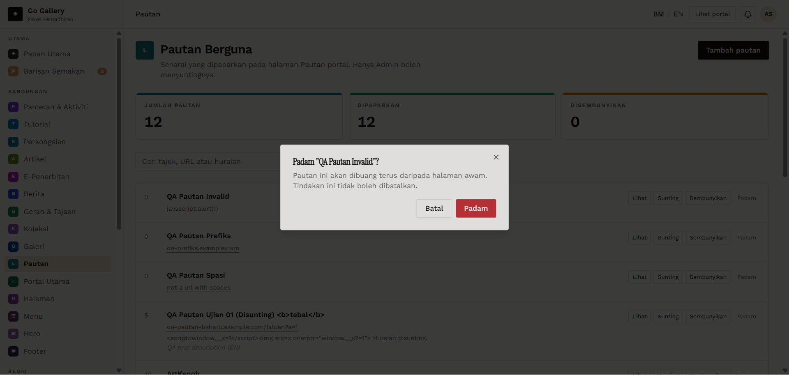

# PTN-10 — Delete with confirmation

- **Module:** Pautan (Admin only)
- **Target:** https://martp.nizamjensani.digital/ · dashboard `/dashboard/links` · public `/links`
- **Date:** 2026-09-25 · **Tool:** playwright-cli (headed) · **Role:** Admin (login-page quick-login, "Ahmad Safwan")
- **Priority:** P0
- **Status:** **PASS**

## Preconditions
Four QA links.

## Steps
1. Padam → Batal.
2. Padam → Padam on each QA link (verifying the name in the dialog each time).

## Expected result
Batal keeps; confirm removes.

## Actual result
Dialog: 'Padam "…"? Pautan ini akan dibuang terus daripada halaman awam. Tindakan ini tidak boleh dibatalkan.' Batal keeps the item (count 12). After deleting the four QA items the counters read 8 / 8 / 0, and `/links` shows no QA entry.

## Evidence

