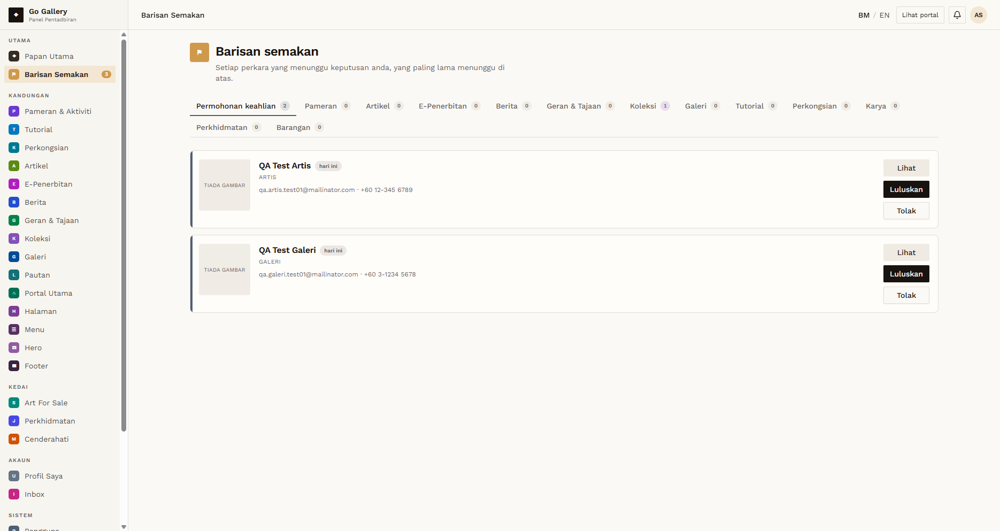

# PND-01 — Confirm the QA accounts are still unapproved

- **Module:** Unapproved Artist and Galeri accounts (cross-module)
- **Target:** https://martp.nizamjensani.digital/ · admin `/dashboard/review-queue` · roles Artist and Galeri
- **Date:** 2026-09-25 · **Tool:** playwright-cli (headed)
- **Priority:** P0
- **Status:** **PASS (precondition)**

## Preconditions
QA Artist and QA Galeri registered earlier; never approved.

## Steps
1. Admin opens `/dashboard/review-queue`.

## Expected result
Both accounts listed under Permohonan keahlian.

## Actual result
'Permohonan keahlian 2': `QA Test Artis` (ARTIS) and `QA Test Galeri` (GALERI) with Lihat / Luluskan / Tolak. So every result below is for accounts that admin has not approved.

## Evidence

