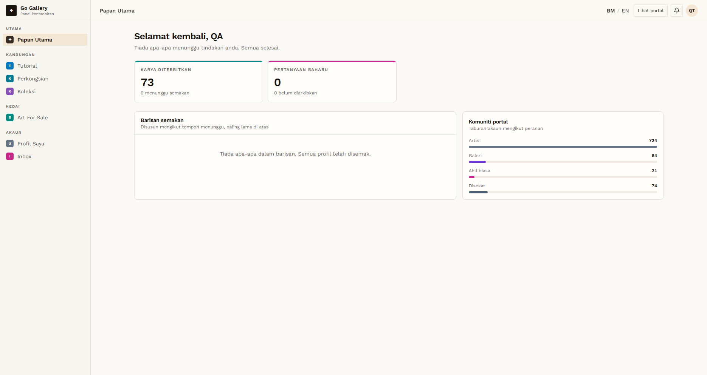

# PND-02 — What an unapproved Artist can open

- **Module:** Unapproved Artist and Galeri accounts (cross-module)
- **Target:** https://martp.nizamjensani.digital/ · admin `/dashboard/review-queue` · roles Artist and Galeri
- **Date:** 2026-09-25 · **Tool:** playwright-cli (headed)
- **Priority:** P0
- **Status:** **PASS (observation: no restriction)**

## Preconditions
QA Artist logged in (profile pending).

## Steps
1. Read the dashboard and sidebar.
2. Open each dashboard module URL and note the HTTP status.

## Expected result
Same access as an approved artist, or a restricted view.

## Actual result
Sidebar: Tutorial, Perkongsian, Koleksi, Art For Sale, Profil Saya, Inbox. Status 200: tutorials, sharings, collection, art-for-sale, profile, inbox. 403: galleries, articles, news, epublications, exhibitions, grants, links, homepage, services, merchandises, users, review-queue. Nothing is restricted because the account is unapproved.

## Evidence

