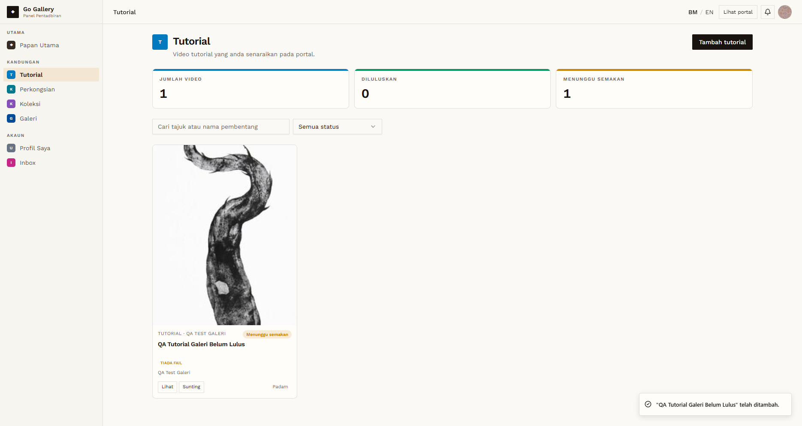

# PND-05 — Submit content while unapproved

- **Module:** Unapproved Artist and Galeri accounts (cross-module)
- **Target:** https://martp.nizamjensani.digital/ · admin `/dashboard/review-queue` · roles Artist and Galeri
- **Date:** 2026-09-25 · **Tool:** playwright-cli (headed)
- **Priority:** P0
- **Status:** **PASS (observation: uploads allowed before approval)**

## Preconditions
Unapproved accounts.

## Steps
1. Artist: create Tutorial, Perkongsian, Koleksi and Art For Sale items (with images).
2. Galeri: create Tutorial, Perkongsian, Koleksi and a Galeri with slideshow and images.
3. Check status and public visibility.

## Expected result
Uploads accepted and held for review, or blocked until the account is approved.

## Actual result
All submissions were accepted, each stored as 'Menunggu semakan' and hidden from public search (results in the Tutorial, Perkongsian, Koleksi, Art For Sale and Galeri test docs; for this run a Galeri tutorial with a cover image was created again). The admin review queue counted them. Account approval is not required to submit content; item approval is what gates publication.

## Evidence

