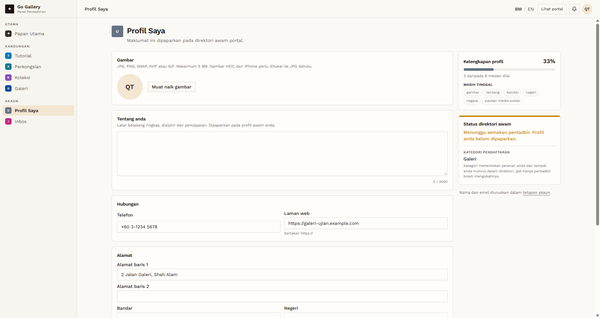
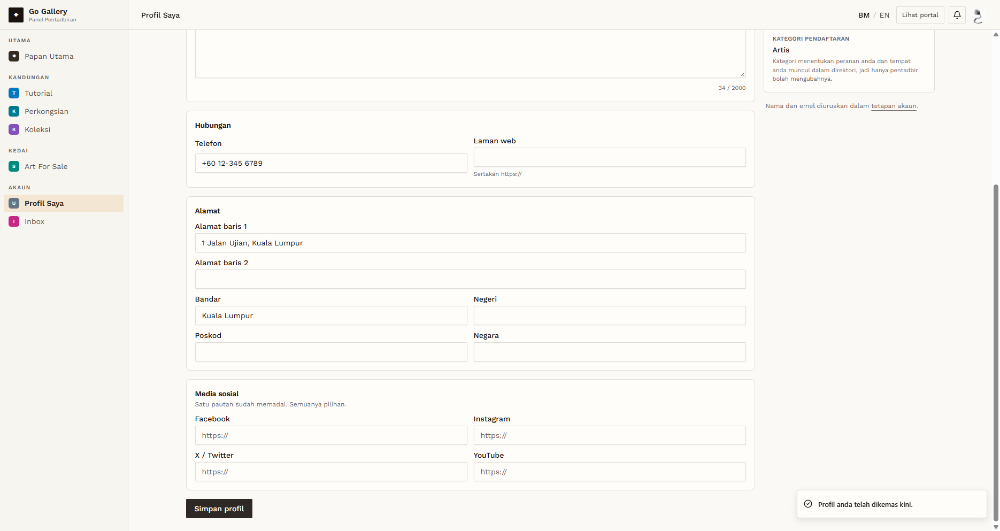
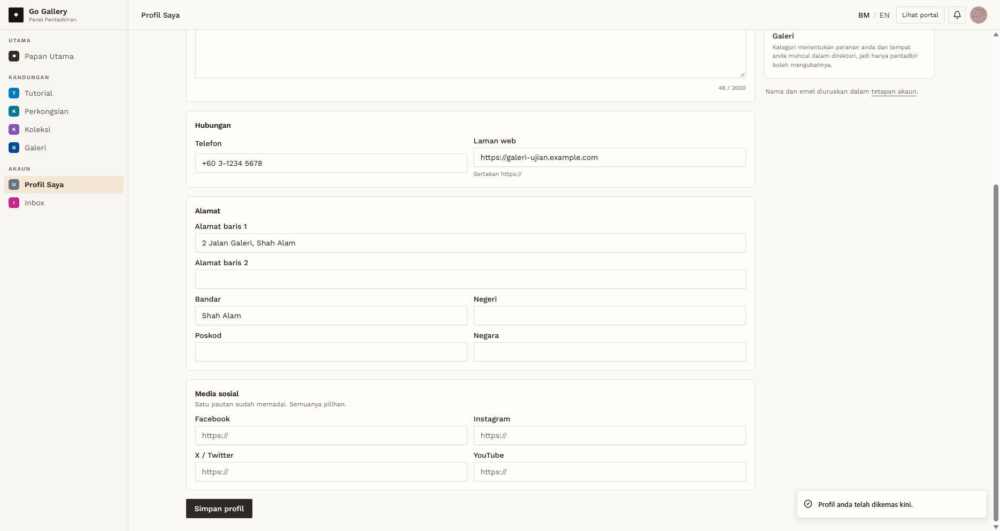

# PND-06 — Edit profile and upload a photo while unapproved

- **Module:** Unapproved Artist and Galeri accounts (cross-module)
- **Target:** https://martp.nizamjensani.digital/ · admin `/dashboard/review-queue` · roles Artist and Galeri
- **Date:** 2026-09-25 · **Tool:** playwright-cli (headed)
- **Priority:** P0
- **Status:** **PASS (observation: allowed before approval)**

## Preconditions
Unapproved accounts.

## Steps
1. Profil Saya: upload a photo (JPG), fill Tentang and Bandar; Simpan profil.
2. Reload.
3. Repeat as the other role.

## Expected result
Allowed, or blocked until approval.

## Actual result
Both roles: toast 'Profil anda telah dikemas kini.'; values persisted after reload; photo saved under `/storage/avatars/…`. The page says 'Maklumat ini dipaparkan pada direktori awam portal'. Inbox opens (empty: 0 pertanyaan).

## Evidence
  
