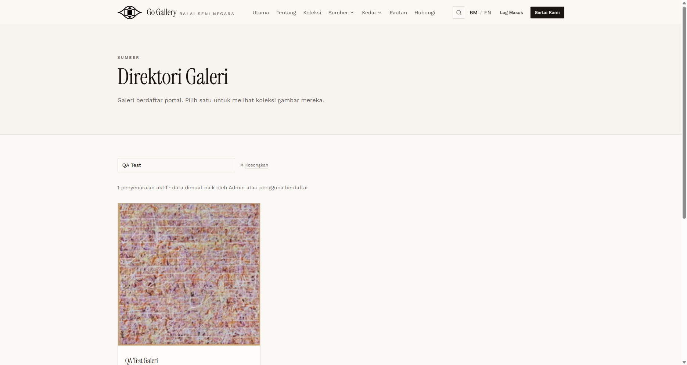
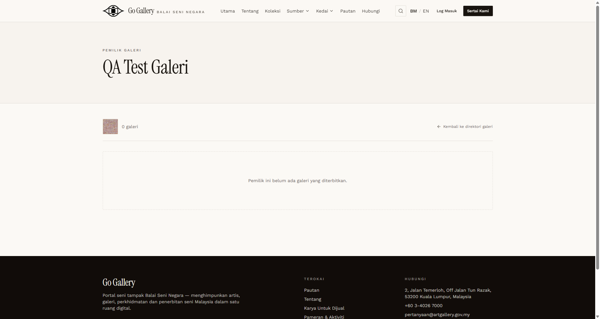

# PND-08 — Unapproved Galeri in the public directory

- **Module:** Unapproved Artist and Galeri accounts (cross-module)
- **Target:** https://martp.nizamjensani.digital/ · admin `/dashboard/review-queue` · roles Artist and Galeri
- **Date:** 2026-09-25 · **Tool:** playwright-cli (headed)
- **Priority:** P0
- **Status:** **FAIL**

## Preconditions
QA Galeri unapproved; no published galeri; profile has a photo.

## Steps
1. Anonymous searches `/resources/galleries?search=QA Test`.
2. Open `/resources/galleries/815-qa-test-galeri`.

## Expected result
Not listed until admin approves the membership (as for artists).

## Actual result
**The unapproved Galeri is publicly listed**: '1 penyenaraian aktif · QA Test Galeri · Galeri 0' with its uploaded profile photo, and its profile page (200) is open ('Pemilik ini belum ada galeri yang diterbitkan'). The Artist directory hides the pending artist, so the two roles are treated differently, and the registration page promised review first. **Defect: unapproved Galeri accounts appear publicly.**

## Evidence
 

## Retest 2026-10-01
**FAIL (still open)**. See [RT-PND-08](../retest-2026-10-01/RT-PND-08.md).
