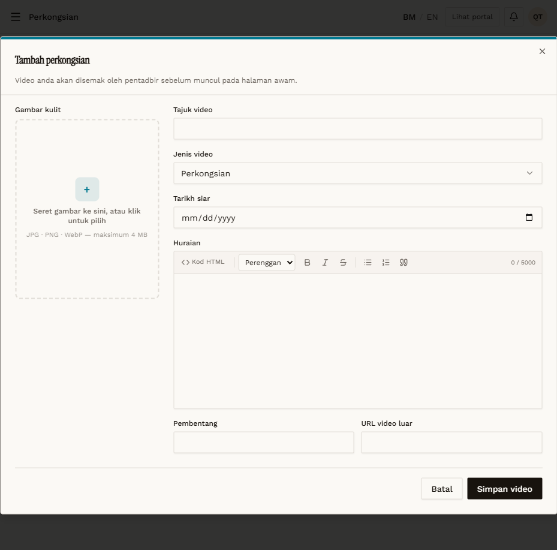

# SHR-01 — Create — required title (Galeri)

- **Module:** Perkongsian (Galeri, Artis and Admin)
- **Target:** https://martp.nizamjensani.digital/ · public page `/resources/sharings`
- **Date:** 2026-09-25 · **Tool:** playwright-cli (headed)
- **Priority:** P1
- **Status:** **PASS (cosmetic)**

## Preconditions
Galeri QA account logged in, `/dashboard/sharings`.

## Steps
1. Tambah perkongsian.
2. Simpan video with Tajuk video empty.

## Expected result
Blocked.

## Actual result
Modal stays open; native tooltip 'Please fill in this field.' (English on Malay UI — cosmetic).

## Evidence

