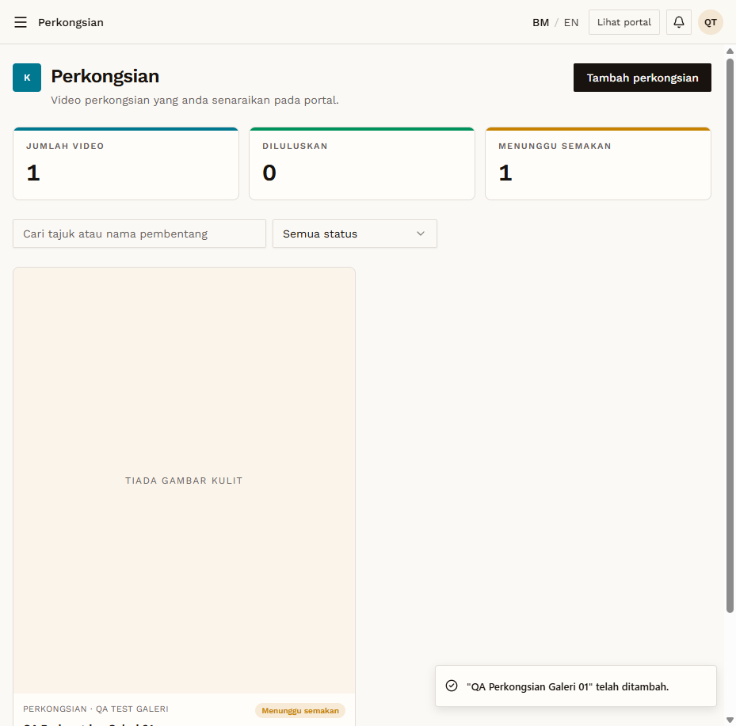

# SHR-02 — Galeri creates perkongsian → pending, hidden

- **Module:** Perkongsian (Galeri, Artis and Admin)
- **Target:** https://martp.nizamjensani.digital/ · public page `/resources/sharings`
- **Date:** 2026-09-25 · **Tool:** playwright-cli (headed)
- **Priority:** P0
- **Status:** **PASS**

## Preconditions
Galeri QA account logged in.

## Steps
1. Fill Tajuk `QA Perkongsian Galeri 01`, date, Huraian, Pembentang, YouTube URL.
2. Simpan video.
3. Search `/resources/sharings?search=QA Perkongsian` publicly.

## Expected result
Saved as 'Menunggu semakan'; not public.

## Actual result
List shows JUMLAH 1 / MENUNGGU 1. Public search: 0 results.

## Evidence

