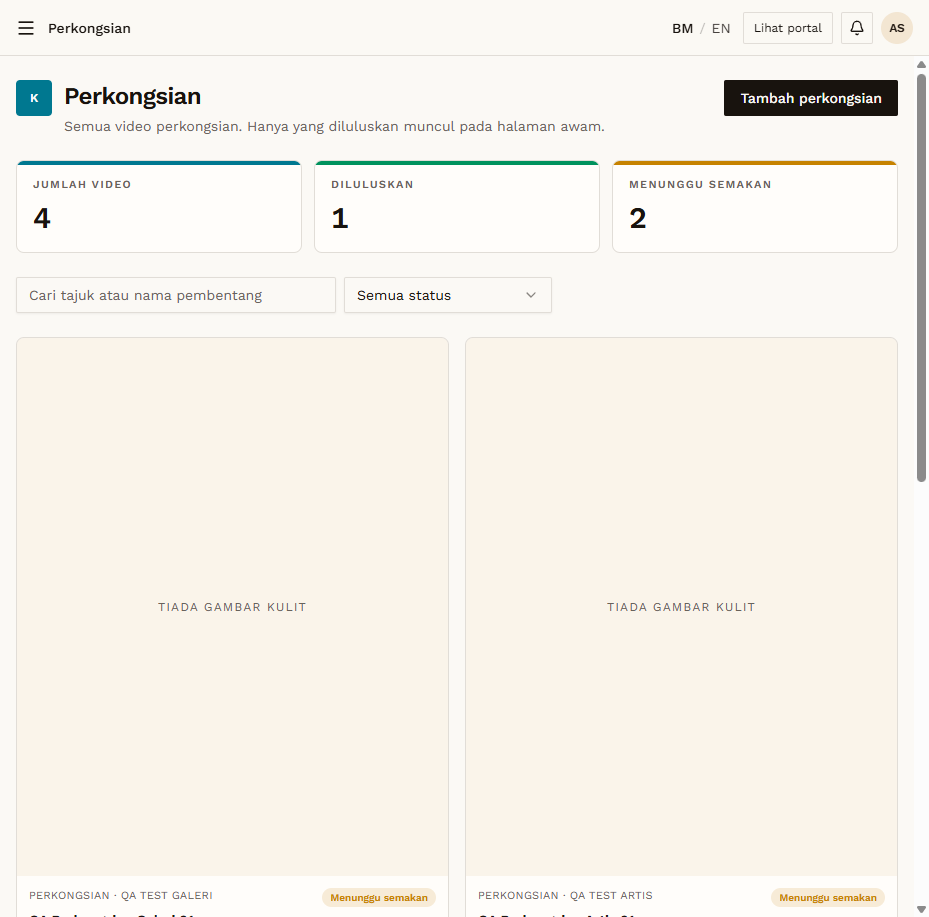

# SHR-04 — Admin sees pending items from both roles

- **Module:** Perkongsian (Galeri, Artis and Admin)
- **Target:** https://martp.nizamjensani.digital/ · public page `/resources/sharings`
- **Date:** 2026-09-25 · **Tool:** playwright-cli (headed)
- **Priority:** P0
- **Status:** **PASS**

## Preconditions
Admin logged in via login-page quick-login (ADMIN 'Ahmad Safwan').

## Steps
1. Open `/dashboard/sharings`.

## Expected result
Both pending items with Luluskan/Tolak/Padam.

## Actual result
Both QA items listed (Galeri and Artis) with 'Menunggu semakan' and all actions; counters JUMLAH 4, DILULUSKAN 1, MENUNGGU 2 (ignoring test data of others).

## Evidence

