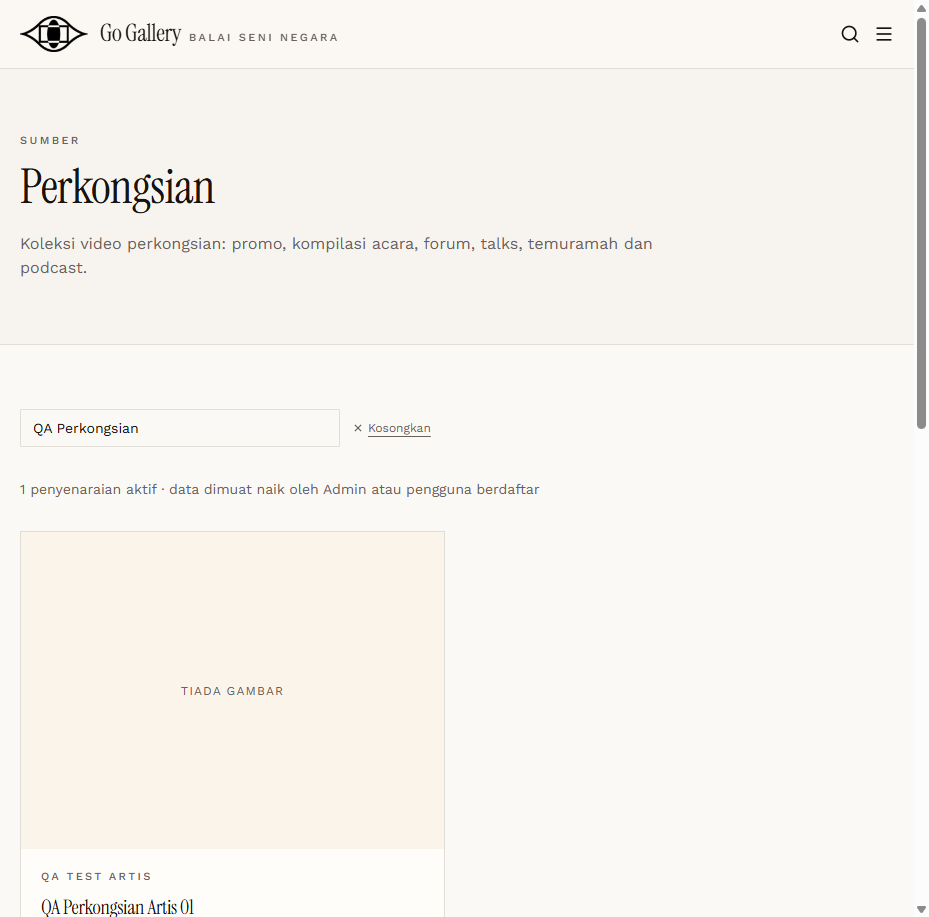

# SHR-05 — Admin approves Artist item → public

- **Module:** Perkongsian (Galeri, Artis and Admin)
- **Target:** https://martp.nizamjensani.digital/ · public page `/resources/sharings`
- **Date:** 2026-09-25 · **Tool:** playwright-cli (headed)
- **Priority:** P0
- **Status:** **PASS**

## Preconditions
SHR-03 done.

## Steps
1. Click Luluskan on the Artis item.
2. Search public page.

## Expected result
Status Diluluskan; visible publicly.

## Actual result
Toast '… kini Diluluskan.' Public page shows the item with author and dates. (Item without external URL/file still lists correctly.)

## Evidence

