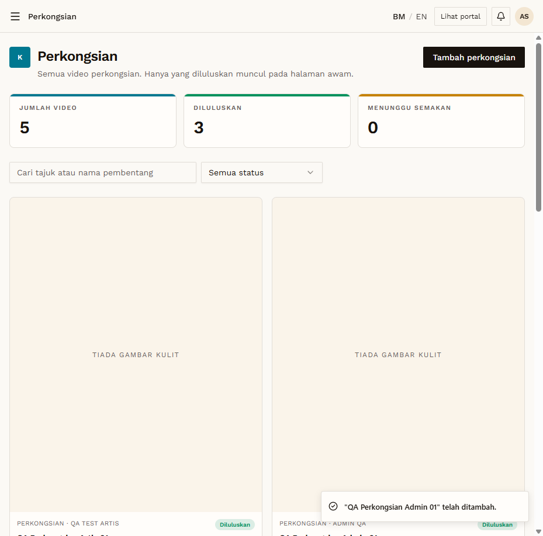
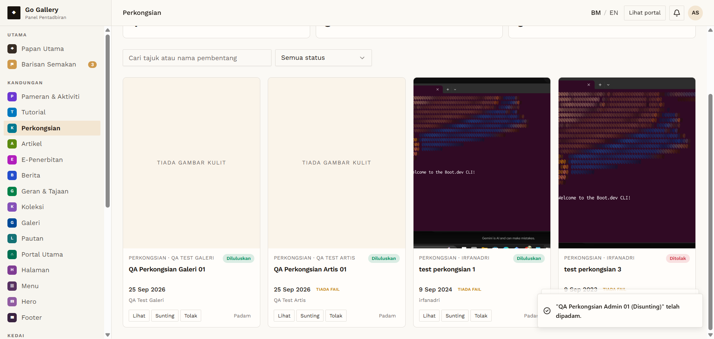

# SHR-07 — Admin creates, edits and deletes own perkongsian

- **Module:** Perkongsian (Galeri, Artis and Admin)
- **Target:** https://martp.nizamjensani.digital/ · public page `/resources/sharings`
- **Date:** 2026-09-25 · **Tool:** playwright-cli (headed)
- **Priority:** P0
- **Status:** **PASS**

## Preconditions
Admin logged in.

## Steps
1. Create `QA Perkongsian Admin 01`.
2. Check public page.
3. Sunting → rename '(Disunting)'.
4. Padam → confirm.

## Expected result
Admin content published without review; edit and delete work.

## Actual result
Created as **Diluluskan** straight away and visible publicly (author Ahmad Safwan). Edit saved (toast 'telah dikemas kini'). Delete removed it from the list.

## Evidence
 
