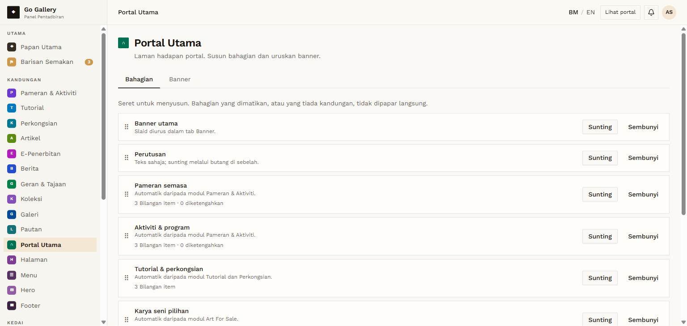
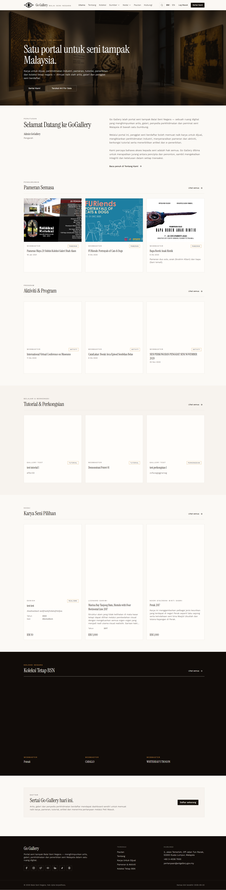

# PTU-01 — Overview and homepage baseline

- **Module:** Portal Utama (Admin only)
- **Target:** https://martp.nizamjensani.digital/ · dashboard `/dashboard/homepage` (tabs Bahagian, Banner) · public homepage `/`
- **Date:** 2026-09-25 · **Tool:** playwright-cli (headed) · **Role:** Admin (login-page quick-login, "Ahmad Safwan")
- **Priority:** P1
- **Status:** **PASS**

## Preconditions
Admin logged in (login-page quick-login 'Ahmad Safwan').

## Steps
1. Open `/dashboard/homepage`.
2. Record sections and tabs.
3. Record the public homepage sections.

## Expected result
Dashboard lists the homepage sections; the public homepage matches.

## Actual result
Two tabs: Bahagian and Banner. Ten sections in order: Banner utama, Perutusan, Pameran semasa, Aktiviti & program, Tutorial & perkongsian, Karya seni pilihan, Koleksi Tetap BSN, Berita terkini, Ajakan mendaftar, Carian pantas (DIMATIKAN). Each has Sunting and Sembunyi/Papar; auto sections show their item count. The public homepage shows the same order except: Carian pantas (disabled) and Berita terkini (0 items, so empty sections are not shown, as the page says).

## Evidence
 
