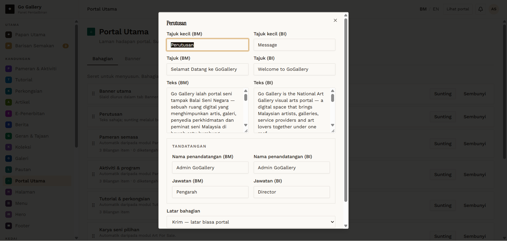
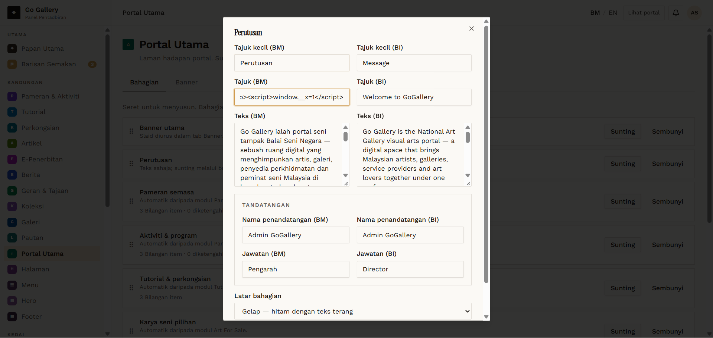
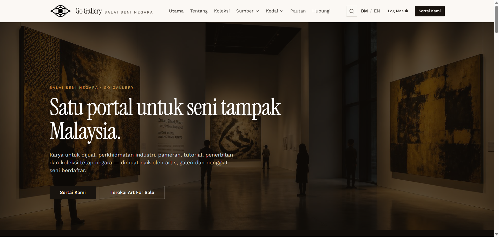

# PTU-02 — Edit a text section (Perutusan)

- **Module:** Portal Utama (Admin only)
- **Target:** https://martp.nizamjensani.digital/ · dashboard `/dashboard/homepage` (tabs Bahagian, Banner) · public homepage `/`
- **Date:** 2026-09-25 · **Tool:** playwright-cli (headed) · **Role:** Admin (login-page quick-login, "Ahmad Safwan")
- **Priority:** P0
- **Status:** **PASS**

## Preconditions
Original values recorded (heading BM 'Selamat Datang ke GoGallery', theme 'default').

## Steps
1. Sunting Perutusan; note fields (eyebrow, heading, text, signer, title, theme BM/EN).
2. Change Tajuk (BM) to `QA Perutusan Ujian <b>tebal</b>` and theme to Gelap; save.
3. Check the homepage.
4. Restore the original values.

## Expected result
Change appears on the homepage; markup escaped; restore works.

## Actual result
Toast 'Bahagian Perutusan dikemas kini.' The homepage heading showed the text literally (no `<b>`, no `<script>`, `window.__x` undefined). After restoring heading and theme the homepage returned to the original text and the form values matched the original lengths.

## Evidence
  
