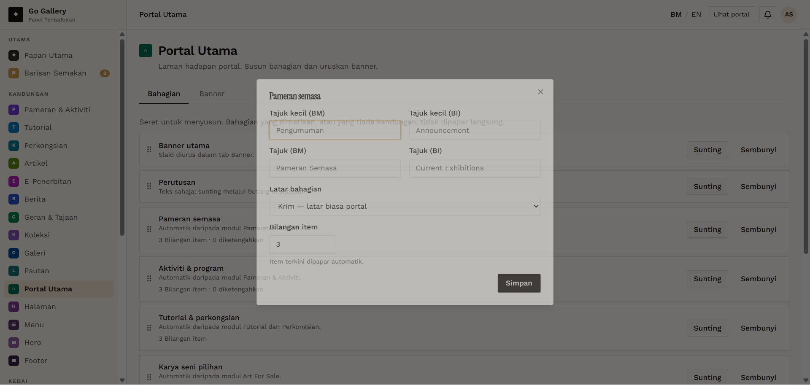
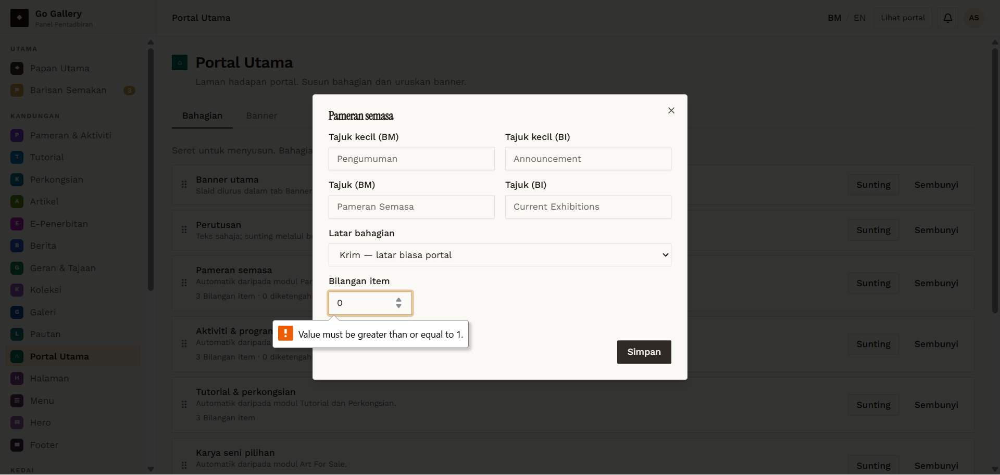

# PTU-03 — Edit an automatic section (item limit)

- **Module:** Portal Utama (Admin only)
- **Target:** https://martp.nizamjensani.digital/ · dashboard `/dashboard/homepage` (tabs Bahagian, Banner) · public homepage `/`
- **Date:** 2026-09-25 · **Tool:** playwright-cli (headed) · **Role:** Admin (login-page quick-login, "Ahmad Safwan")
- **Priority:** P0
- **Status:** **PASS (cosmetic)**

## Preconditions
Pameran semasa section, item limit 3.

## Steps
1. Sunting Pameran semasa (fields: eyebrow, heading, theme, Bilangan item).
2. Save with 25, then 0.
3. Save with 1; count the homepage cards.
4. Restore to 3.

## Expected result
Limit is 1–24 and drives the homepage.

## Actual result
25 and 0 refused with native messages 'Value must be less than or equal to 24.' / 'greater than or equal to 1.' (English on a Malay UI). With 1 the homepage shows one exhibition (2 links per card); restored to 3 gives 3 cards again. Toast 'Bahagian Pameran semasa dikemas kini.'

## Evidence
 
