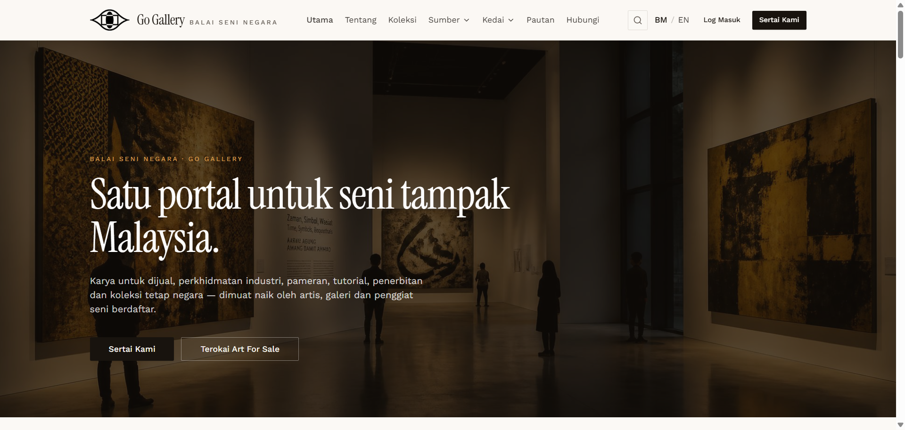

# PTU-05 — Enable and disable Carian pantas

- **Module:** Portal Utama (Admin only)
- **Target:** https://martp.nizamjensani.digital/ · dashboard `/dashboard/homepage` (tabs Bahagian, Banner) · public homepage `/`
- **Date:** 2026-09-25 · **Tool:** playwright-cli (headed) · **Role:** Admin (login-page quick-login, "Ahmad Safwan")
- **Priority:** P1
- **Status:** **PASS**

## Preconditions
Carian pantas is DIMATIKAN (off).

## Steps
1. Papar Carian pantas; open the homepage.
2. Sembunyi it again.

## Expected result
Search form appears while on; restored to off.

## Actual result
Toast 'Bahagian Carian pantas dipaparkan.' The homepage gained a 'Cari dalam portal' section with a search input ('Tajuk, nama artis, kata kunci…'). After Sembunyi the dashboard shows DIMATIKAN again.

## Evidence

