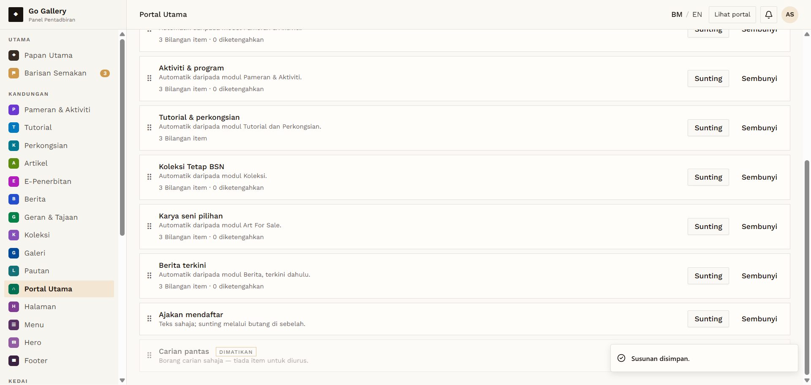
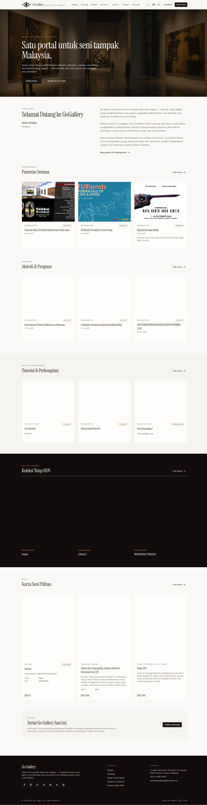

# PTU-06 — Drag to reorder sections

- **Module:** Portal Utama (Admin only)
- **Target:** https://martp.nizamjensani.digital/ · dashboard `/dashboard/homepage` (tabs Bahagian, Banner) · public homepage `/`
- **Date:** 2026-09-25 · **Tool:** playwright-cli (headed) · **Role:** Admin (login-page quick-login, "Ahmad Safwan")
- **Priority:** P0
- **Status:** **PASS (observation)**

## Preconditions
Order: … Karya seni pilihan, Koleksi Tetap BSN, …

## Steps
1. Drag Koleksi Tetap BSN above Karya seni pilihan.
2. Check dashboard and homepage.
3. Restore the order.

## Expected result
Order saved and applied to the homepage.

## Actual result
Toast 'Susunan disimpan.'; the homepage showed Koleksi Tetap BSN before Karya Seni Pilihan. Restoring worked when dragging the lower item upward again (toast shown, original order confirmed on the homepage). One automated attempt to drag in the other direction produced no toast or change — likely a limitation of the automated drag, not confirmed as a defect. No keyboard alternative was found.

## Evidence
 
