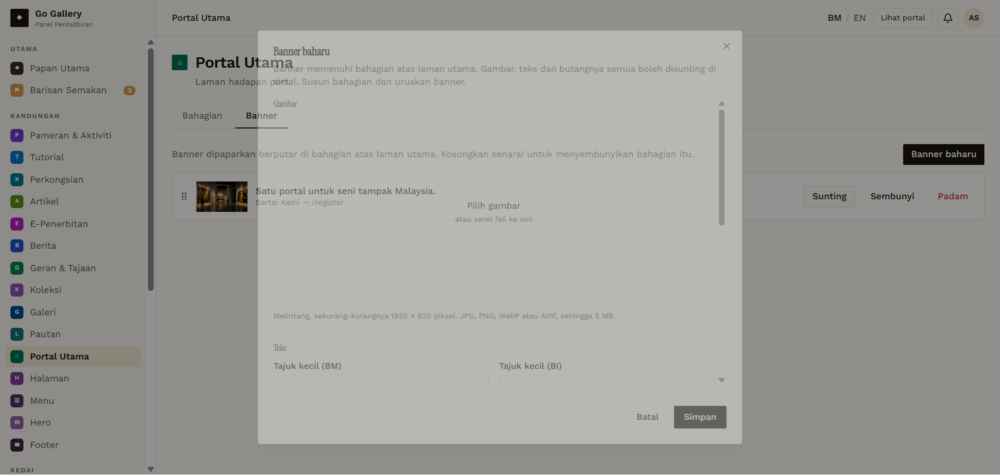
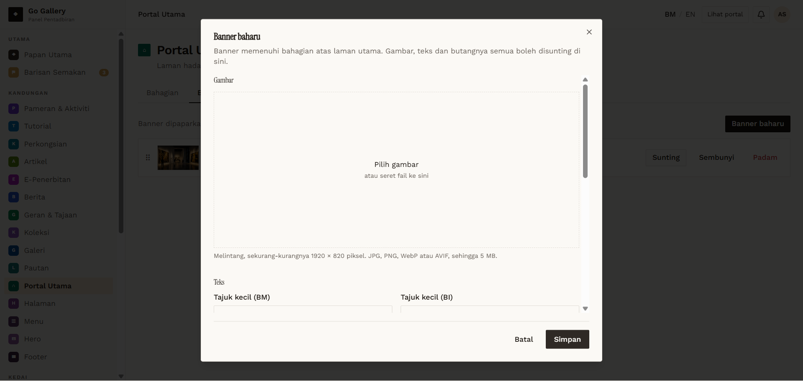
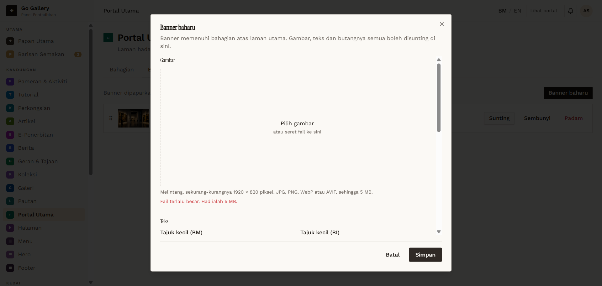
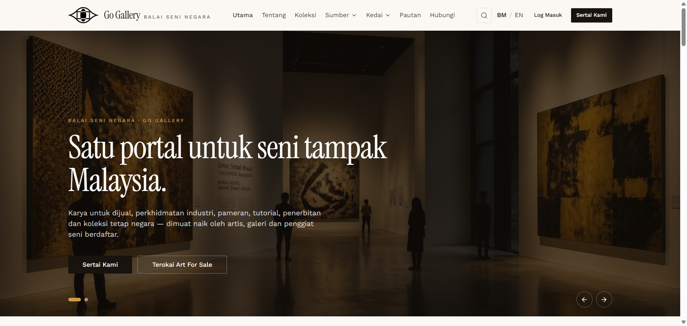

# PTU-07 — Banner — create: required title, image type and size

- **Module:** Portal Utama (Admin only)
- **Target:** https://martp.nizamjensani.digital/ · dashboard `/dashboard/homepage` (tabs Bahagian, Banner) · public homepage `/`
- **Date:** 2026-09-25 · **Tool:** playwright-cli (headed) · **Role:** Admin (login-page quick-login, "Ahmad Safwan")
- **Priority:** P1
- **Status:** **PASS (observation: no size-dimension warning)**

## Preconditions
Banner tab open; recommended image 1920 × 820 px, up to 5 MB (JPG, PNG, WebP, AVIF).

## Steps
1. Banner baharu; Simpan empty.
2. Choose a text file; choose a 6 MB image.
3. Create `QA Banner Ujian 01` with a 200 px-wide JPG, title BM/EN, text and a button.

## Expected result
Title required; bad files rejected; valid banner added to the rotation.

## Actual result
Empty save: 'Medan Tajuk (BM) wajib diisi.' (server message, Malay). Text file: 'Hanya fail JPG, PNG, WebP atau AVIF diterima.' The 6 MB file was also refused. The valid banner was saved (toast 'Banner … ditambah.') and appeared as the second slide of the homepage carousel. A 200 px image is far below the 1920 × 820 recommendation and no warning was shown.

## Evidence
   
