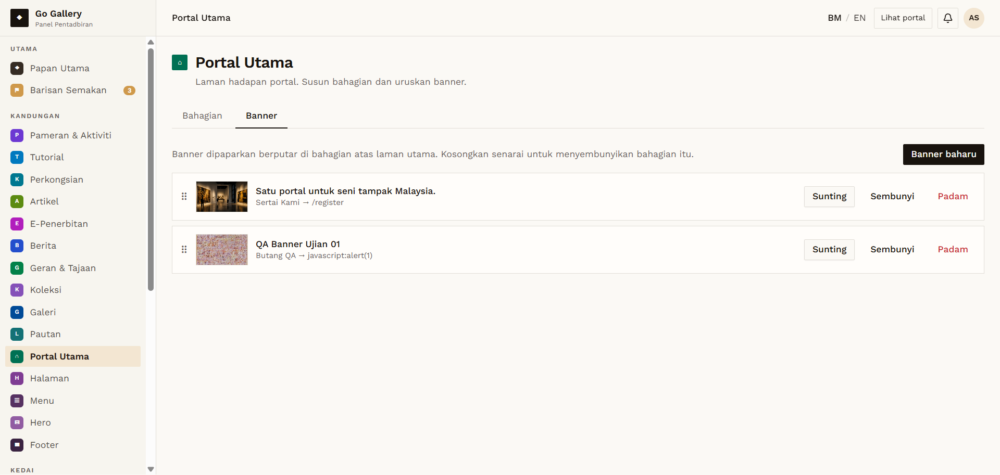
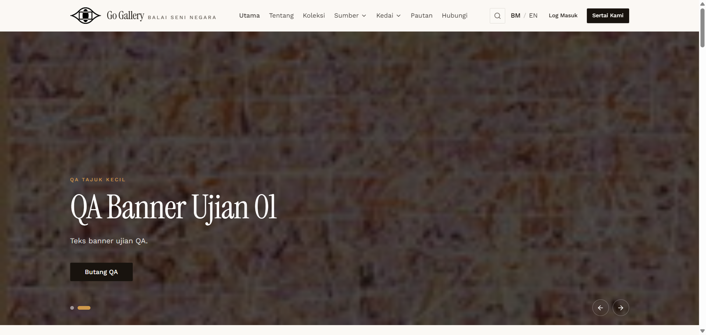

# PTU-08 — Banner button link — invalid value

- **Module:** Portal Utama (Admin only)
- **Target:** https://martp.nizamjensani.digital/ · dashboard `/dashboard/homepage` (tabs Bahagian, Banner) · public homepage `/`
- **Date:** 2026-09-25 · **Tool:** playwright-cli (headed) · **Role:** Admin (login-page quick-login, "Ahmad Safwan")
- **Priority:** P0
- **Status:** **FAIL**

## Preconditions
Banner form open.

## Steps
1. Set Pautan butang (primary) to `javascript:alert(1)`; save.
2. Open the homepage; wait for the QA slide; click the button.

## Expected result
Rejected with a clear message.

## Actual result
Saved without any error. At render time the value is mangled to `lert(1)` (a relative link), so the homepage button goes to `https://…/lert(1)` — a 404. The script did not run (the output is neutralised), but the input is neither validated on save nor rendered as intended. **Defect: invalid button links are accepted and publish a broken link.**

## Evidence
 
