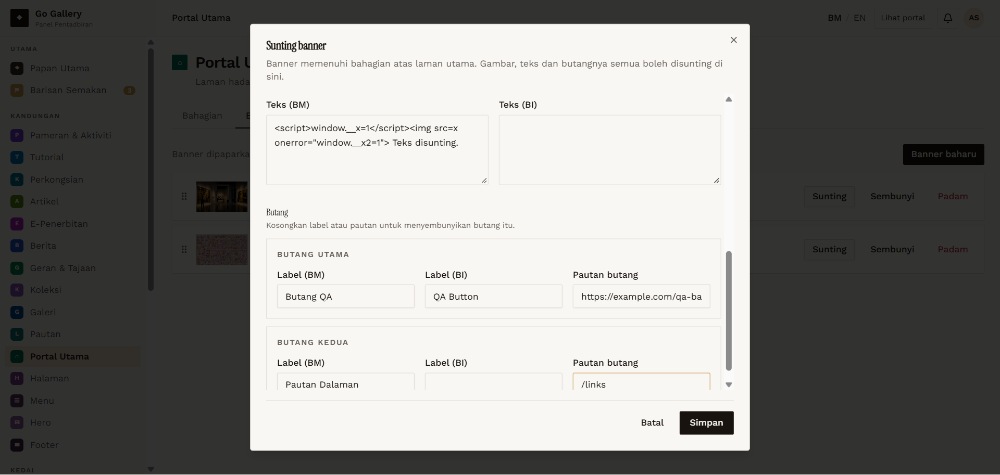
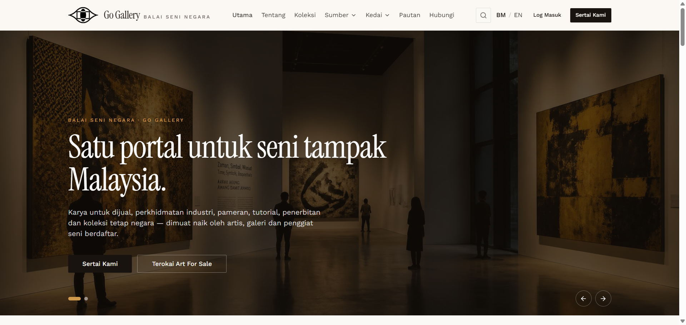

# PTU-09 — Banner — edit, escaping and link targets

- **Module:** Portal Utama (Admin only)
- **Target:** https://martp.nizamjensani.digital/ · dashboard `/dashboard/homepage` (tabs Bahagian, Banner) · public homepage `/`
- **Date:** 2026-09-25 · **Tool:** playwright-cli (headed) · **Role:** Admin (login-page quick-login, "Ahmad Safwan")
- **Priority:** P0
- **Status:** **PASS**

## Preconditions
QA banner exists.

## Steps
1. Sunting; read pre-filled values.
2. Change title to `… <b>tebal</b>`, text with `<script>`/`onerror`, primary link `https://example.com/qa-banner`, second button `Pautan Dalaman` → `/links`; save.
3. Watch the homepage carousel.

## Expected result
Saved; markup escaped; links behave correctly.

## Actual result
Pre-filled correctly (including the stored invalid link). Toast 'dikemas kini'. Title and text shown literally, no `<b>`, `<script>` or `onerror`, `window.__x*` undefined. External link opens in a new tab (`_blank`); the internal `/links` link opens in the same tab.

## Evidence
 
