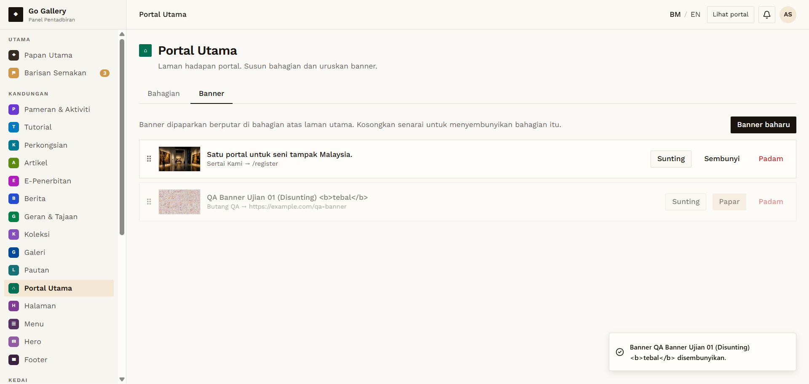

# PTU-10 — Banner — Sembunyi / Papar

- **Module:** Portal Utama (Admin only)
- **Target:** https://martp.nizamjensani.digital/ · dashboard `/dashboard/homepage` (tabs Bahagian, Banner) · public homepage `/`
- **Date:** 2026-09-25 · **Tool:** playwright-cli (headed) · **Role:** Admin (login-page quick-login, "Ahmad Safwan")
- **Priority:** P0
- **Status:** **PASS**

## Preconditions
QA banner in the rotation.

## Steps
1. Sembunyi; watch the homepage.
2. Papar; watch again.

## Expected result
Hidden slide leaves the carousel; returns when shown.

## Actual result
Toast '… disembunyikan.'; the homepage rotation showed only the original banner. Papar: toast '… dipaparkan.' and the QA slide is back.

## Evidence

