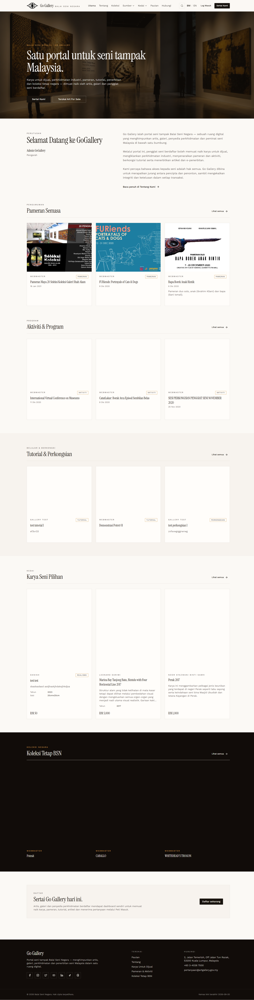

# PTU-11 — Banner — delete

- **Module:** Portal Utama (Admin only)
- **Target:** https://martp.nizamjensani.digital/ · dashboard `/dashboard/homepage` (tabs Bahagian, Banner) · public homepage `/`
- **Date:** 2026-09-25 · **Tool:** playwright-cli (headed) · **Role:** Admin (login-page quick-login, "Ahmad Safwan")
- **Priority:** P0
- **Status:** **FAIL (inconsistent; irreversible without confirmation — needs product decision)**

## Preconditions
QA banner exists next to the original banner.

## Steps
1. Click Padam on the QA banner.

## Expected result
A confirmation dialog like the other modules, then removal.

## Actual result
**No confirmation appeared**: the banner was deleted immediately on the first click (my wait for a dialog timed out and the banner was already gone). Only the QA banner was removed; the original banner and homepage were unaffected. Every other module asks 'Padam …? … tidak boleh dibatalkan.' first. Because there is no Batal, an accidental click on the live banner would delete it.

## Evidence

## Retest 2026-10-01
**PASS (fixed)**. See [RT-PTU-11](../retest-2026-10-01/RT-PTU-11.md).
