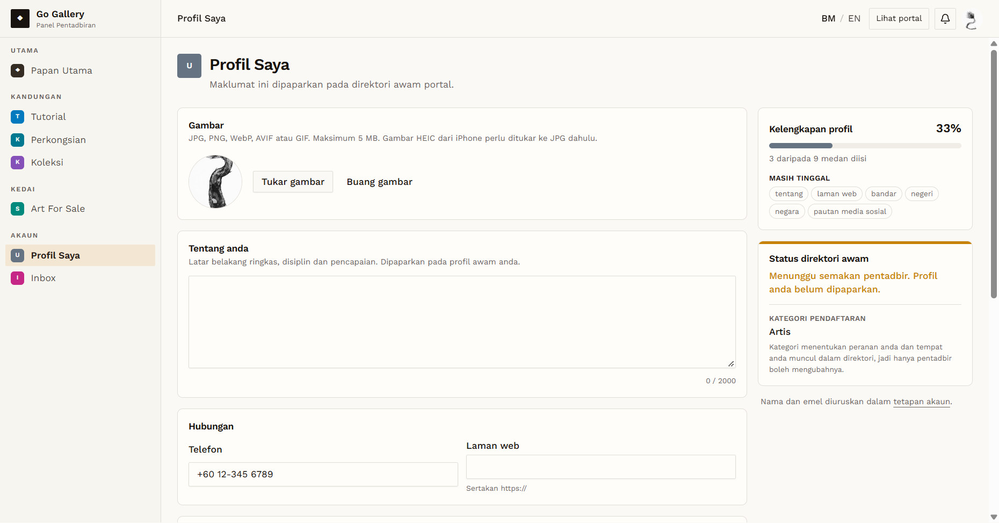
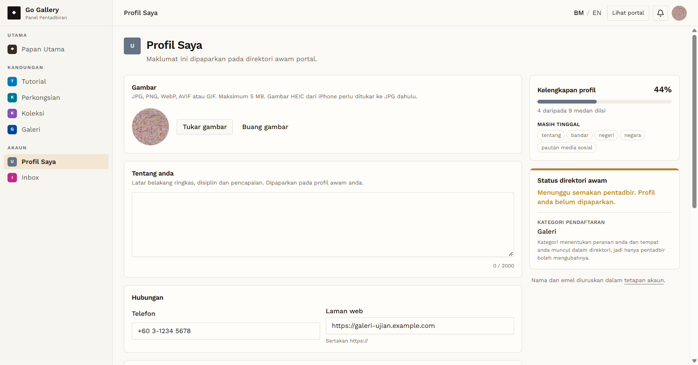
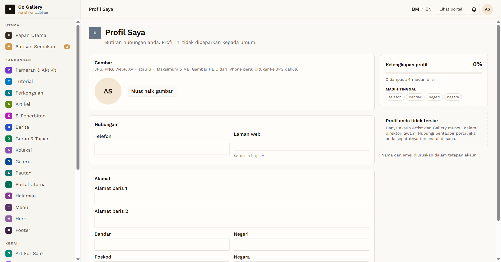

# PRF-01 — Profile page opens with role-specific fields

- **Module:** Profil Pengguna (update profile)
- **Target:** https://martp.nizamjensani.digital/ · `/dashboard/profile` (Profil Saya) · `/settings/profile` (tetapan akaun)
- **Date:** 2026-10-01 · **Tool:** playwright-cli (headed) · **Role:** Artist, Galeri, Admin
- **Priority:** P1
- **Status:** **PASS**

## Preconditions
Logged in as each role (Artist QA, Galeri QA, Admin quick-login "Ahmad Safwan").

## Steps
1. Open "Profil Saya" from the sidebar (`/dashboard/profile`) as each role.
2. Read the form sections, field values and side panels.

## Expected result
Page opens for every role with the current values pre-filled.

## Actual result
All three roles open the page.

- **Artist / Galeri:** Gambar (JPG, PNG, WebP, AVIF, GIF, max 5 MB), Tentang (max 2000, counter), Telefon, Laman web, Alamat baris 1–2, Bandar, Negeri, Poskod, Negara, Facebook, Instagram, X/Twitter, YouTube. No field is required. Side panel: "Kelengkapan profil" (x of 9 fields), "Status direktori awam: Menunggu semakan pentadbir. Profil anda belum dipaparkan." and the registration category, which only an admin can change. Name and email are managed in "tetapan akaun" (`/settings/profile`).
- **Admin:** a smaller form: Gambar, Telefon, Laman web, address fields (no Tentang, no social links). Header text: "Profil ini tidak dipaparkan kepada umum". Completeness counts 4 fields. Panel: "Profil anda tidak tersiar — Hanya akaun Artist dan Gallery muncul dalam direktori awam."
- Existing values were pre-filled for all roles (e.g. Artist phone `+60 12-345 6789`, Galeri website `https://galeri-ujian.example.com`; all Admin fields empty).

## Evidence
  
