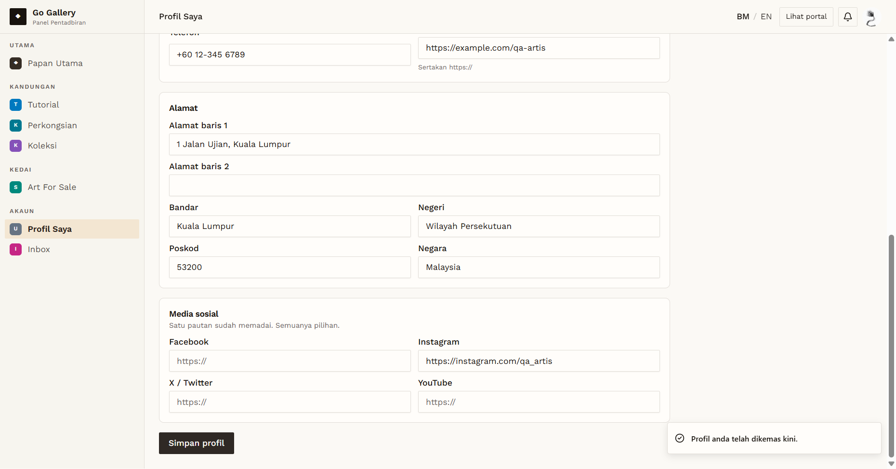

# PRF-02 — Artist updates profile fields and they persist

- **Module:** Profil Pengguna (update profile)
- **Target:** https://martp.nizamjensani.digital/ · `/dashboard/profile` (Profil Saya) · `/settings/profile` (tetapan akaun)
- **Date:** 2026-10-01 · **Tool:** playwright-cli (headed) · **Role:** Artist (QA)
- **Priority:** P0
- **Status:** **PASS**

## Preconditions
Artist QA logged in. Starting values recorded (PRF-01).

## Steps
1. Fill Tentang, Laman web `https://example.com/qa-artis`, Bandar, Negeri, Poskod `53200`, Negara, Instagram.
2. Click "Simpan profil".
3. Reload the page.

## Expected result
Success message; values kept after reload; completeness updates.

## Actual result
Toast "Profil anda telah dikemas kini." Every value was still there after reload. Completeness went to "9 daripada 9 medan diisi" / 100% ("Profil anda lengkap"). Clearing the optional fields later also saved correctly (back to "2 daripada 9").

## Evidence

