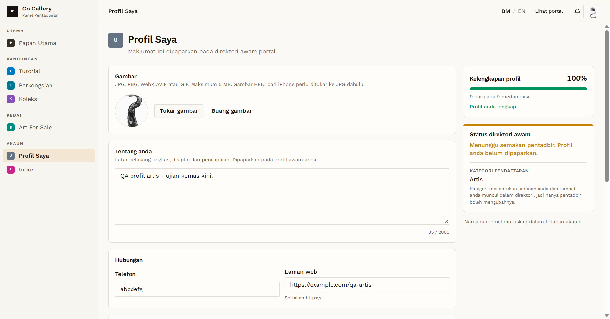

# PRF-04 — Phone and postcode format validation

- **Module:** Profil Pengguna (update profile)
- **Target:** https://martp.nizamjensani.digital/ · `/dashboard/profile` (Profil Saya) · `/settings/profile` (tetapan akaun)
- **Date:** 2026-10-01 · **Tool:** playwright-cli (headed) · **Role:** Artist (QA)
- **Priority:** P2
- **Status:** **FAIL (Low, input validation)**

## Preconditions
Artist QA logged in.

## Steps
1. Set Telefon to `abcdefg`, save, reload.
2. Set Poskod to `ABCDE`, save, reload.
3. Set Telefon to 60 digits, save.

## Expected result
Telefon accepts only phone characters (digits, +, -, spaces) and Poskod only digits, or at least shows a format error.

## Actual result
`abcdefg` and `ABCDE` were **accepted and saved** (toast "Profil anda telah dikemas kini."; values still there after reload). Only length is checked: 60 digits gives "Medan nombor telefon tidak boleh melebihi 40 aksara." Values were restored afterwards.

The same form is used by the Galeri role (identical fields), so the gap probably applies there too. Not re-run for Galeri.

## Evidence

## Retest 2026-10-01
**FAIL (still open, all 3 roles)**. See [RT-PRF-04](../retest-2026-10-01/RT-PRF-04.md).
