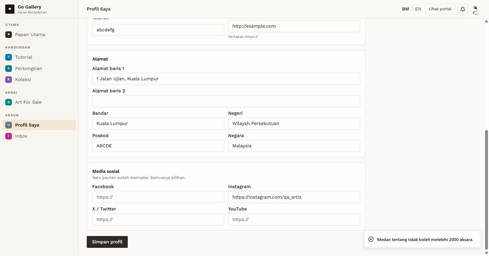

# PRF-05 — Tentang 2000-character limit

- **Module:** Profil Pengguna (update profile)
- **Target:** https://martp.nizamjensani.digital/ · `/dashboard/profile` (Profil Saya) · `/settings/profile` (tetapan akaun)
- **Date:** 2026-10-01 · **Tool:** playwright-cli (headed) · **Role:** Artist (QA)
- **Priority:** P2
- **Status:** **PASS**

## Preconditions
Artist QA logged in.

## Steps
1. Fill Tentang with 1995 characters, then type 10 more.
2. Remove the field limit in the browser, set 2100 characters and save.
3. Reload.

## Expected result
Typing stops at 2000; the server rejects more than 2000.

## Actual result
Typing stopped at 2000 ("2000 / 2000"). With the limit removed in the browser, the counter showed "2100 / 2000" and saving gave "Medan tentang tidak boleh melebihi 2000 aksara." Nothing was saved (the old 35-character value stayed).

## Evidence

