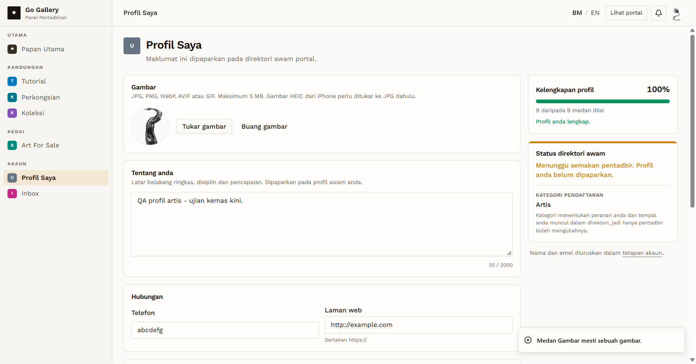

# PRF-06 — Profile photo: wrong file types

- **Module:** Profil Pengguna (update profile)
- **Target:** https://martp.nizamjensani.digital/ · `/dashboard/profile` (Profil Saya) · `/settings/profile` (tetapan akaun)
- **Date:** 2026-10-01 · **Tool:** playwright-cli (headed) · **Role:** Artist (QA)
- **Priority:** P1
- **Status:** **PASS**

## Preconditions
Artist QA logged in, with an existing photo.

## Steps
1. Choose `fake.txt` (text) as the photo.
2. Choose `fake.jpg` (text file renamed to .jpg).
3. Choose `evil.svg` (SVG with `onload` and `<script>`).
4. Reload after each.

## Expected result
All rejected with a message; the current photo stays.

## Actual result
The upload starts as soon as a file is chosen. All three files were rejected with "Medan Gambar mesti sebuah gambar." The existing photo URL did not change.

## Evidence
  
