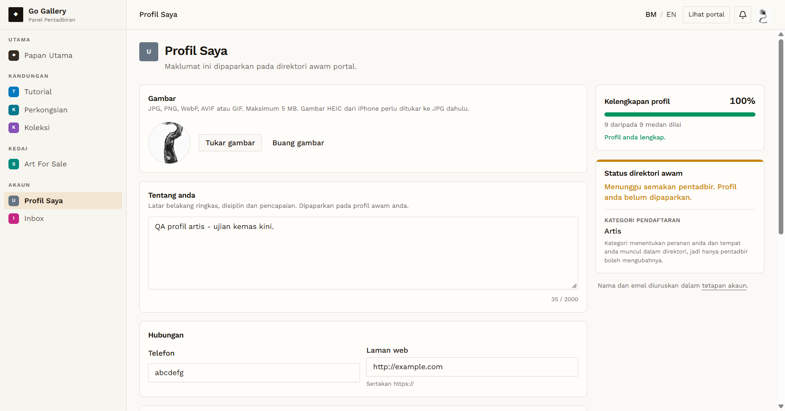

# PRF-07 — Profile photo: file over 5 MB

- **Module:** Profil Pengguna (update profile)
- **Target:** https://martp.nizamjensani.digital/ · `/dashboard/profile` (Profil Saya) · `/settings/profile` (tetapan akaun)
- **Date:** 2026-10-01 · **Tool:** playwright-cli (headed) · **Role:** Artist (QA)
- **Priority:** P1
- **Status:** **PASS**

## Preconditions
Artist QA logged in. Test file `big.jpg`, 8.5 MB (two JPGs joined; the project images are all under 5 MB).

## Steps
1. Choose `big.jpg` as the photo.
2. Wait for the response.

## Expected result
Rejected with a size message; current photo stays.

## Actual result
After about 1 second: "Saiz Gambar tidak boleh melebihi 5120 kilobait." The photo did not change. (The first try read the page after 2.5 s and saw no toast; the retry showed the message from 1 s to 4 s, so it was a timing issue, not a missing message.)

## Evidence

