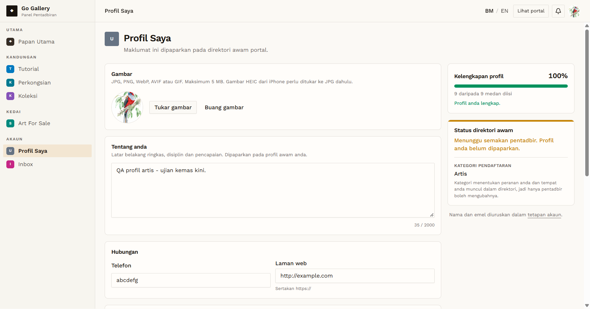
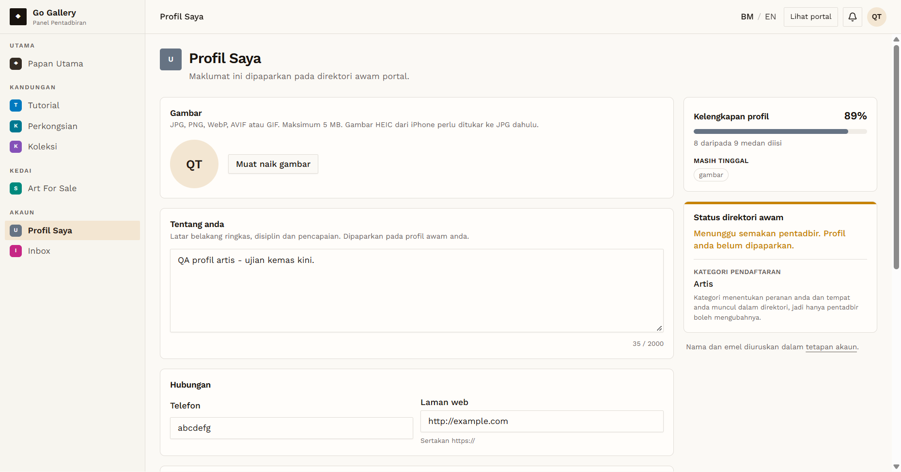

# PRF-08 — Profile photo: valid upload and remove

- **Module:** Profil Pengguna (update profile)
- **Target:** https://martp.nizamjensani.digital/ · `/dashboard/profile` (Profil Saya) · `/settings/profile` (tetapan akaun)
- **Date:** 2026-10-01 · **Tool:** playwright-cli (headed) · **Role:** Artist (QA)
- **Priority:** P0
- **Status:** **PASS (observation: no confirmation before removing)**

## Preconditions
Artist QA logged in, with an existing photo.

## Steps
1. Choose a valid PNG (285 KB).
2. Reload; check the profile image and the header avatar.
3. Click "Buang gambar".
4. Reload; check old file URLs with the cache disabled.

## Expected result
New photo shown everywhere; remove works; old files no longer served.

## Actual result
Toast "Gambar profil telah dikemas kini." The new `/storage/avatars/…png` image loaded in the profile card and the top-bar avatar. "Buang gambar" removed it **straight away, with no confirmation**, with the toast "Gambar profil telah dibuang." After reload there was no image and no remove button. With the cache disabled, both the replaced and the removed file URLs return 404, so old photos are deleted. (A first check without disabling the cache showed 200 from the browser cache.)

## Evidence
 
