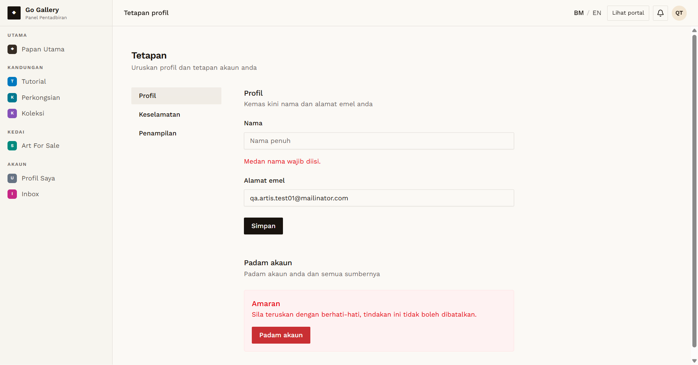
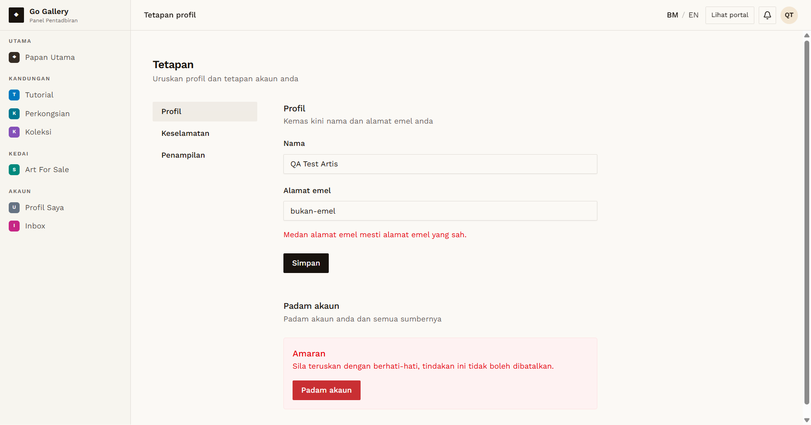
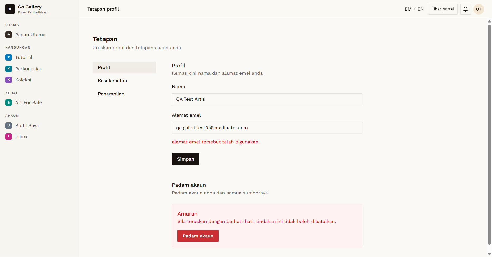

# PRF-09 — Account settings: name and email validation

- **Module:** Profil Pengguna (update profile)
- **Target:** https://martp.nizamjensani.digital/ · `/dashboard/profile` (Profil Saya) · `/settings/profile` (tetapan akaun)
- **Date:** 2026-10-01 · **Tool:** playwright-cli (headed) · **Role:** Artist (QA)
- **Priority:** P1
- **Status:** **PASS**

## Preconditions
Artist QA logged in. `/settings/profile` (link "tetapan akaun").

## Steps
1. Clear Nama and save (browser validation turned off to reach the server).
2. Set email `bukan-emel` and save.
3. Set email to the Galeri QA account email and save.
4. Reload after each.

## Expected result
All rejected with a message; nothing saved.

## Actual result
Empty name: "Medan nama wajib diisi." (the browser also blocks it). Invalid email: "Medan alamat emel mesti alamat emel yang sah." Duplicate email: "alamat emel tersebut telah digunakan." After reload the name and email were unchanged.

## Evidence
  
