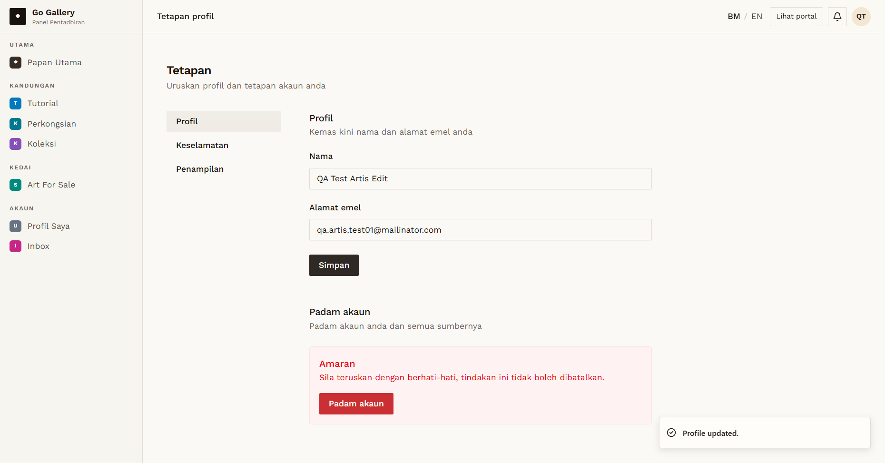

# PRF-10 — Artist changes display name

- **Module:** Profil Pengguna (update profile)
- **Target:** https://martp.nizamjensani.digital/ · `/dashboard/profile` (Profil Saya) · `/settings/profile` (tetapan akaun)
- **Date:** 2026-10-01 · **Tool:** playwright-cli (headed) · **Role:** Artist (QA)
- **Priority:** P1
- **Status:** **PASS (cosmetic: English toast)**

## Preconditions
Artist QA logged in.

## Steps
1. Change Nama to `QA Test Artis Edit`, Simpan.
2. Reload.
3. Change back to `QA Test Artis`.

## Expected result
Saved and shown after reload.

## Actual result
Saved; the value was kept after reload; restored afterwards. **Cosmetic:** the toast is in English, "Profile updated.", while the site is in Malay and the Profil Saya toast is in Malay.

## Evidence

