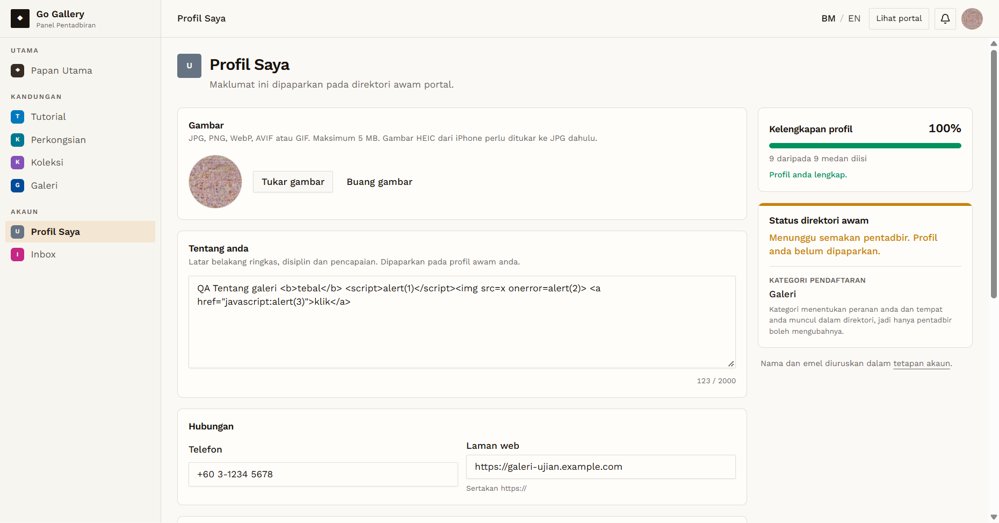

# PRF-11 — Galeri updates profile fields and they persist

- **Module:** Profil Pengguna (update profile)
- **Target:** https://martp.nizamjensani.digital/ · `/dashboard/profile` (Profil Saya) · `/settings/profile` (tetapan akaun)
- **Date:** 2026-10-01 · **Tool:** playwright-cli (headed) · **Role:** Galeri (QA)
- **Priority:** P0
- **Status:** **PASS**

## Preconditions
Galeri QA logged in. Starting values recorded.

## Steps
1. Fill Tentang, Bandar `Shah Alam`, Negeri `Selangor`, Poskod `40000`, Negara, Facebook.
2. Simpan profil; reload.
3. Restore the original values; reload.

## Expected result
Saved and kept after reload.

## Actual result
Toast "Profil anda telah dikemas kini."; values kept after reload; completeness "9 daripada 9". Restoring (clearing fields) also saved correctly.

## Evidence

