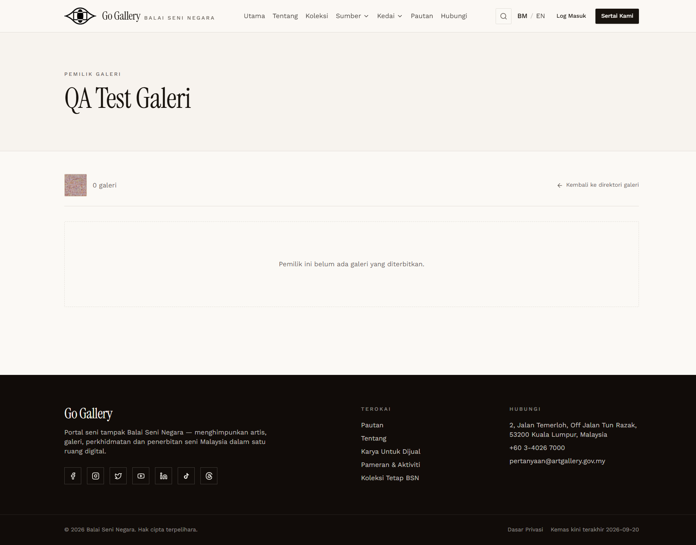

# PRF-12 — Updated profile fields on the public directory

- **Module:** Profil Pengguna (update profile)
- **Target:** https://martp.nizamjensani.digital/ · `/dashboard/profile` (Profil Saya) · `/settings/profile` (tetapan akaun)
- **Date:** 2026-10-01 · **Tool:** playwright-cli (headed) · **Role:** Artist, Galeri, anonymous visitor
- **Priority:** P1
- **Status:** **NOT OBSERVABLE**

## Preconditions
PRF-02 / PRF-11 saved. Both QA accounts are still awaiting membership approval.

## Steps
1. Search the public gallery directory (`/resources/galleries?search=QA`) and open "QA Test Galeri".
2. Compare with approved public profiles (2 artists, 2 galleries; read-only).

## Expected result
The profile page says "Maklumat ini dipaparkan pada direktori awam portal", so Tentang, contact and social links should appear on the public profile once approved.

## Actual result
The QA Artist is hidden from the public directory while pending, so nothing can be checked there. The QA Galeri page (`/resources/galleries/815-qa-test-galeri`) shows only the name, photo and "0 galeri". **None** of the updated fields (Tentang, address, Facebook) appear. Approved gallery-owner pages also show only name and galleries. Approved **artist** pages do show Instagram/Facebook links, so artist fields probably appear after approval, but that could not be checked with an approved account.

**Observation:** the Galeri side panel says "Profil anda belum dipaparkan" but the account's name and photo are already public. This matches the existing failure [PND-08](../pending-accounts/PND-08-galeri-public-before-approval.md) and is not counted again.

## Evidence

