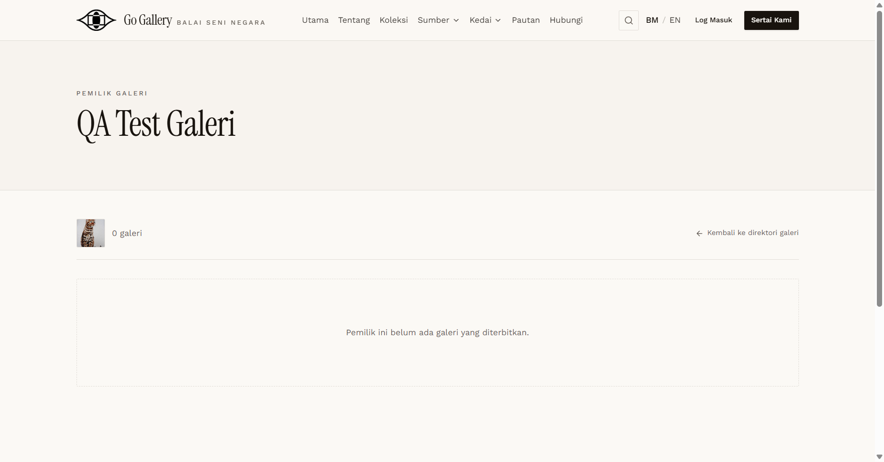

# PRF-13 — Galeri photo and name changes on the public page

- **Module:** Profil Pengguna (update profile)
- **Target:** https://martp.nizamjensani.digital/ · `/dashboard/profile` (Profil Saya) · `/settings/profile` (tetapan akaun)
- **Date:** 2026-10-01 · **Tool:** playwright-cli (headed) · **Role:** Galeri (QA), anonymous visitor
- **Priority:** P1
- **Status:** **PASS**

## Preconditions
Galeri QA logged in (the account is listed publicly, see PND-08).

## Steps
1. Upload a valid JPG as the profile photo.
2. Open the public gallery owner page.
3. Change Nama (see PRF-14) and reopen the directory.

## Expected result
Public page shows the new photo and name.

## Actual result
Toast "Gambar profil telah dikemas kini." The public page image changed from `2fbs…jpg` to the new `HM08…jpg` and loaded. After the name change the directory and page heading showed the new name. The URL slug changes with the name (`815-qa-test-galeri-img-srcx-…`), and the old URL (`815-qa-test-galeri`) still opened (200).

## Evidence

