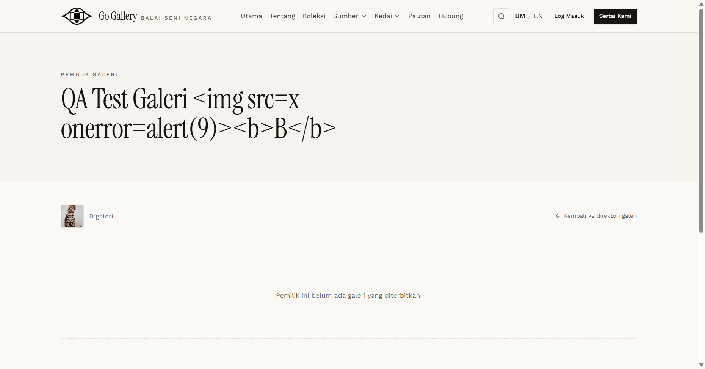
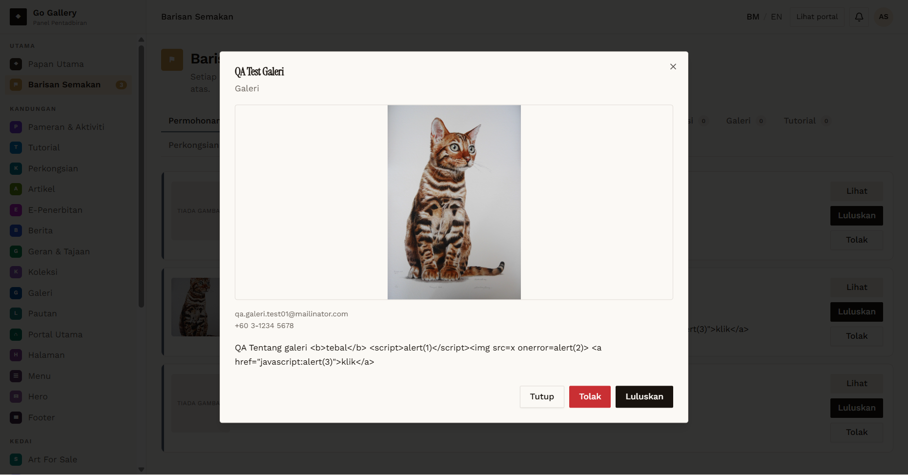
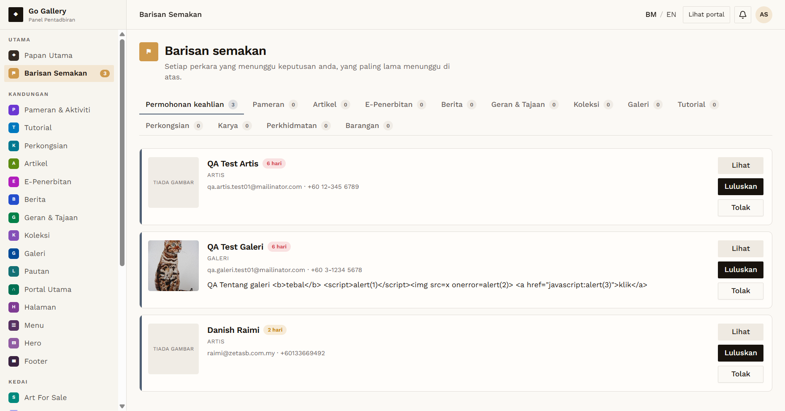

# PRF-14 — HTML/script injection in Tentang and Nama

- **Module:** Profil Pengguna (update profile)
- **Target:** https://martp.nizamjensani.digital/ · `/dashboard/profile` (Profil Saya) · `/settings/profile` (tetapan akaun)
- **Date:** 2026-10-01 · **Tool:** playwright-cli (headed) · **Role:** Galeri (QA), Admin
- **Priority:** P0
- **Status:** **PASS**

## Preconditions
Galeri QA logged in; a dialog listener counted any `alert`.

## Steps
1. Set Tentang to `QA Tentang galeri <b>tebal</b>  <a href="javascript:alert(3)">klik</a>`, save.
2. Set Nama to `QA Test Galeri <b>B</b>`, save.
3. Open the public directory and gallery owner page.
4. As Admin open Barisan Semakan (list and "Lihat" view) and Jejak Audit.
5. Restore both values.

## Expected result
Shown as plain text everywhere; no script, `onerror`, `javascript:` link or dialog.

## Actual result
Both values were saved as typed. Public page, directory, review queue (list and "Lihat" dialog) and audit trail all show the text literally (`` visible as characters). No `<script>`, no `[onerror]`, no `javascript:` link, no `<b>` element, 0 dialogs. Both fields were restored.

## Evidence
  
