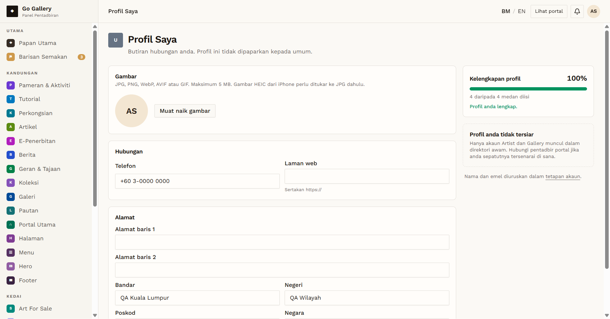
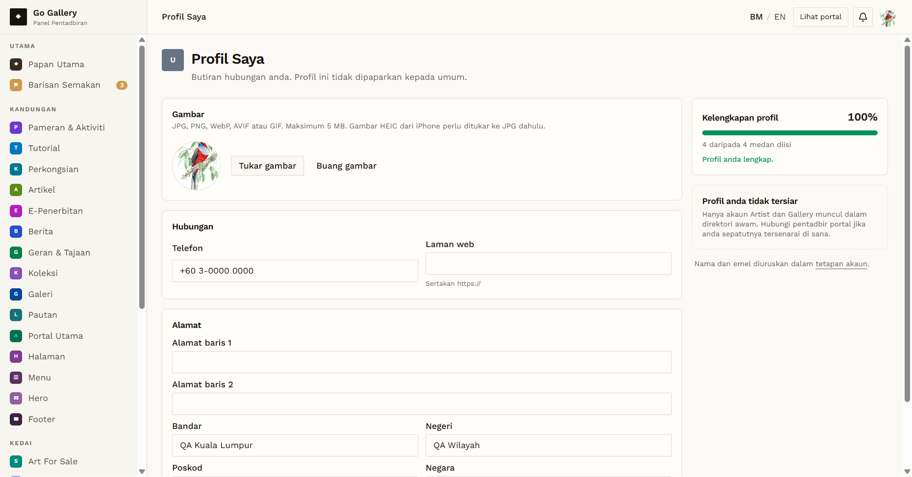

# PRF-15 — Admin updates profile fields and photo

- **Module:** Profil Pengguna (update profile)
- **Target:** https://martp.nizamjensani.digital/ · `/dashboard/profile` (Profil Saya) · `/settings/profile` (tetapan akaun)
- **Date:** 2026-10-01 · **Tool:** playwright-cli (headed) · **Role:** Admin (quick-login "Ahmad Safwan")
- **Priority:** P0
- **Status:** **PASS**

## Preconditions
Admin logged in. All admin profile fields were empty and there was no photo, so the starting state can be restored exactly.

## Steps
1. Set Laman web `bukan-url`, save (PRF-03).
2. Fill Telefon, Bandar, Negeri, Negara with QA values; save; reload.
3. Upload a PNG; reload; click "Buang gambar".
4. Clear all fields; save; reload.

## Expected result
Valid changes saved and kept after reload; photo upload/remove works; state restored.

## Actual result
Invalid URL rejected. Valid save gave "Profil anda telah dikemas kini."; values kept after reload; "4 daripada 4 medan diisi". Photo uploaded ("Gambar profil telah dikemas kini.") and removed. After restore, every field is empty and there is no photo, the same as at the start.

## Evidence
 
