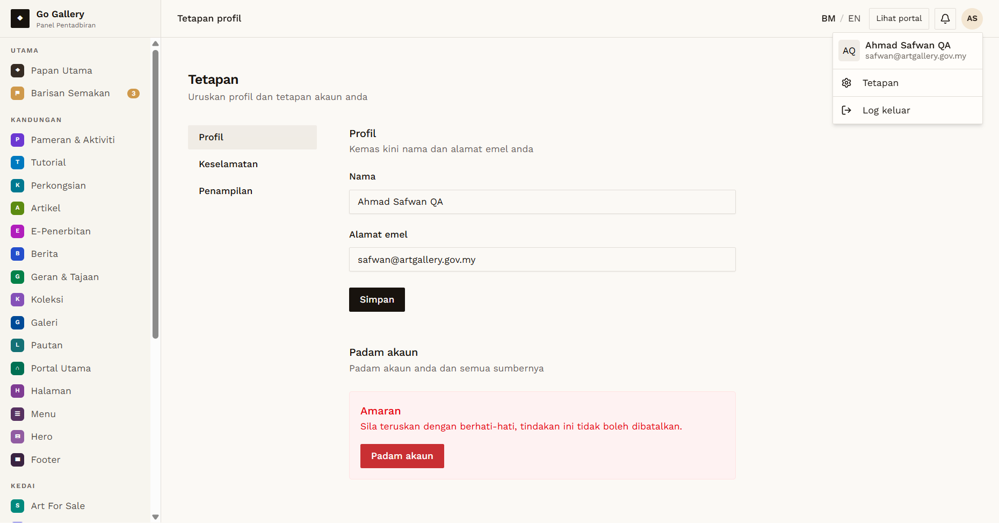

# PRF-16 — Admin changes display name; invalid email

- **Module:** Profil Pengguna (update profile)
- **Target:** https://martp.nizamjensani.digital/ · `/dashboard/profile` (Profil Saya) · `/settings/profile` (tetapan akaun)
- **Date:** 2026-10-01 · **Tool:** playwright-cli (headed) · **Role:** Admin (quick-login "Ahmad Safwan")
- **Priority:** P1
- **Status:** **PASS (cosmetic: English toast)**

## Preconditions
Admin logged in.

## Steps
1. Set email `bukan-emel`, save.
2. Change Nama to `Ahmad Safwan QA`, save; reload; open the account menu.
3. Change back to `Ahmad Safwan`.

## Expected result
Invalid email rejected; name saved and shown in the account menu; restored.

## Actual result
Invalid email: "Medan alamat emel mesti alamat emel yang sah."; email unchanged. Name saved; the account menu showed "AQ · Ahmad Safwan QA · safwan@artgallery.gov.my". Restored to "Ahmad Safwan" right away. Same English toast "Profile updated." as PRF-10.

## Evidence

